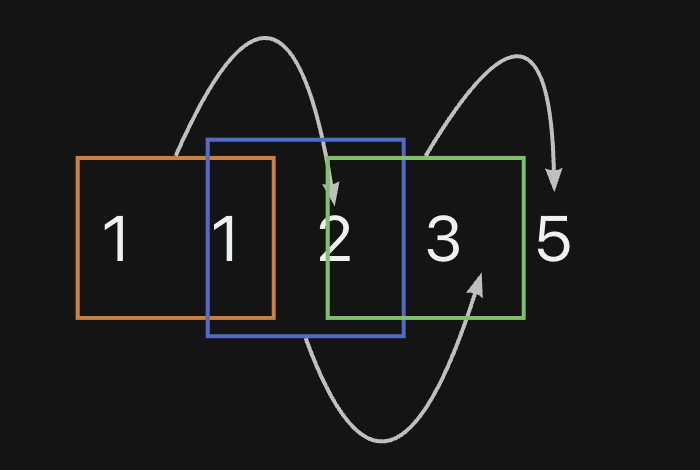
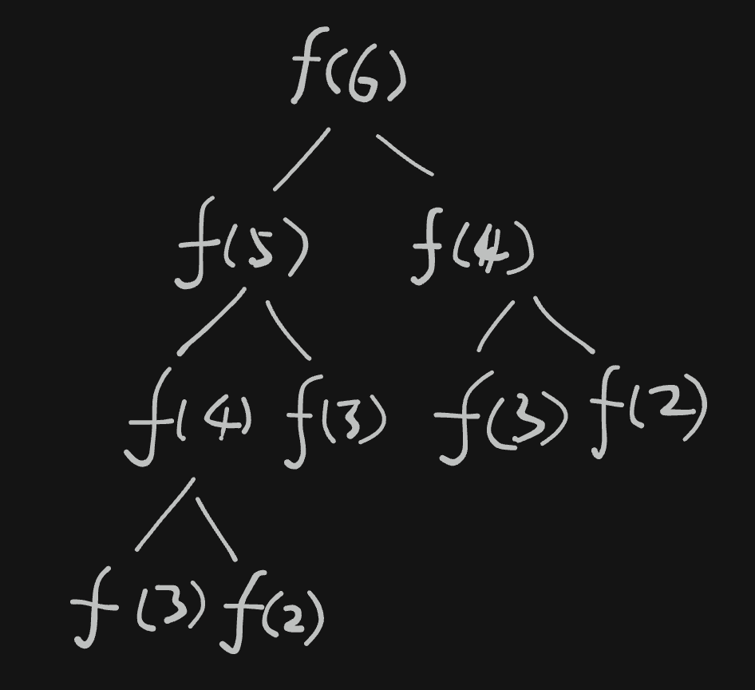
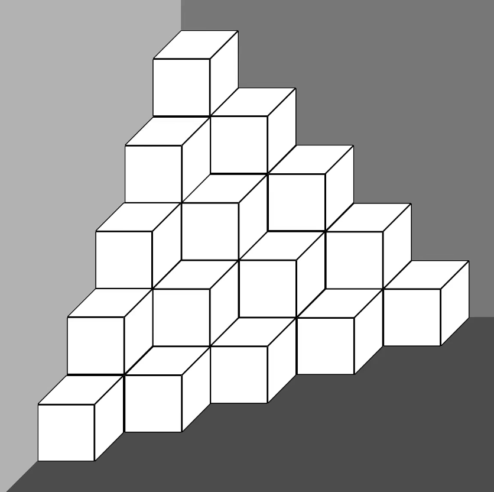

# 递归函数(2)&递推算法

> 小标题：01｜递归函数(2)｜递归函数的缺陷｜引出递推算法

## 本篇简介

本篇文章和视频主要介绍了递归函数的缺陷和递推算法

## 视频

<iframe src="//player.bilibili.com/player.html?aid=365429542&bvid=BV1h94y1G7Ni&cid=1320656902&p=1" scrolling="no" border="0" frameborder="no" framespacing="0" allowfullscreen="true" width="800" height="500px"> </iframe>

## 引入

大家好，欢迎来到《从0开始的C++算法课》的第1期，

本期将带大家发现递归函数的弊端，进一步理解递归，并引出递推算法来弥补递归的缺陷。

### 兔子数列问题

> 有一对兔子，从出生之后的第3个月起每个月都生一对兔子，一对小兔子成长到第3个月后每个月又生一对兔子，假如兔子都不死，问第n个月（n<=50）的兔子总数为多少对？

#### 解析

这是一个非常经典的问题，使用上个视频的知识点递归即可求解。

废话不多说来分析一下：

- 我们把第1个月的这俩只兔子记为 a1 和 a2，此时兔子对数是 1 对。

- 第2个月的时候，兔子依旧是 a1 和 a2，兔子对数依旧是 1 对。

- 第3个月的时候，除了a1和a2之外，a1和a2 还会生一对兔子，可以记为 b1, b2，此时兔子对数是 2 对。

- 第4个月的时候，除了a1、a2、b1、b2之外，注意从第3个月起兔子每个月都会生一对兔子，所以a1和a2还会再生一对兔子，我们记为 c1, c2，此时兔子对数是 3 对。

- 第5个月的时候，除了a1、a2、b1、b2、c1、c2之外，a1和a2会生一对兔子 d1, d2，这个月也恰好是b1、b2出生后的第三个月，因此也会生一对兔子，记为e1 和 e2，此时兔子对数是 5 对。

以此类推...

| 月份 | 兔子                                  | 兔子对数 |
| ---- | ------------------------------------- | -------- |
| 1    | a1, a2                                | 1        |
| 2    | a1, a2                                | 1        |
| 3    | a1, a2, b1, b2                        | 2        |
| 4    | a1, a2, b1, b2, c1, c2                | 3        |
| 5    | a1, a2, b1, b2, c1, c2, d1, d2, e1,e2 | 5        |

其实我们只需要关注每个月有多少对兔子就可以了，得到这样一组数据：

| 月份     | 1    | 2    | 3    | 4    | 5    |
| -------- | ---- | ---- | ---- | ---- | ---- |
| 兔子对数 | 1    | 1    | 2    | 3    | 5    |

请发现它们之间的规律，计算出第6个月有几对兔子？

没错，第6个月的兔子对数是 8 ，怎么来的呢？

第一个数 1 和第二个数 1 相加，得到的是第三个数 2，第二个数 1 和第三个数 2 相加，得到第四个数 3，同理，第五个数 5 是它前面的两个数 2 和 3 相加。

这个规律显而易见是当前项的值等于前一项的值加上前前项的值。

可以把它记作：

> A(n) = A(n-1) + A(n-2) 
>
> 当前项 = 前一项 + 前前项



### 斐波那契数列

熟悉数列的朋友一定发现了，它其实是斐波那契数列，也可以叫做兔子数列。

接下来我们来使用递归的方式求解这个问题：

| 月份     | 1    | 2    | 3    | 4    | 5    | ...  | n-2  | n-1  | n    |
| -------- | ---- | ---- | ---- | ---- | ---- | ---- | ---- | ---- | ---- |
| 兔子对数 | 1    | 1    | 2    | 3    | 5    | ...  |      |      |      |

创建函数之前，首先确定函数是否有返回值，如果有返回值，返回值的类型是什么？

这个问题最终是需要返回第n个月的兔子对数？通过这一点可以确定函数有整型返回值，且有整型参数。

当函数有返回值的时候，先把返回值在函数内部写好，以免忘记，这是一个比较好的编程习惯。

```cpp
#include <iostream>
using namespace std;

int f()  // 创建函数时先思考函数返回值
{
    int res;  // 这个函数需要有整型返回值，因此创建一个整型变量并返回
    return res;	// 返回整型变量
} 

int main()
{
    return 0;
}
```


函数返回的是数列中第n项的结果，根据规律，第n项的值是它前一项和前前项的值的和。这个函数就是用来求解数列某一个项的值的，因此前一项和前前项的值可以表达为f(n-1) 和 f(n-2)。

因此：`res = f(n-1) + f(n-2)`。

```cpp
#include <iostream>
using namespace std;

int f(int n)
{
    int res;
    res = f(n-1) + f(n-2);

    return res;	
} 

int main()
{
    return 0;
}
```


**此时递归函数构建完了吗？**

没有！，递归函数需要有起始项，避免无限制递归，对于这个数列来说，起始项应该有两项，分别是第1项和第2项，因为只有知道了两项才能推算出接下来一项的结果。

在代码中补充递归的起始项，当 n == 1 或者 n==2 的时候，结果都是 1，else里把刚才的规律代码填入即可。

```cpp
#include <iostream>
using namespace std;

int f(int n)
{
    int res;
    if (n==1 || n==2)
    {
        res=1;
    }
    else
    {
        res = f(n-1) + f(n-2);
    }

    return res;	
} 


int main()
{
    int ret = f(6);
    cout << ret << endl;
    return 0;
}
```


把代码放到编程环境中进行测试：

结果正确！

我们也可以使用 for 循环将每一项都输出查看一下结果，结果依旧正确。

```cpp
#include <iostream>
using namespace std;

int f(int n)
{
    int res;

    if (n==1 || n==2)
    {
        res=1;
    }
    else
    {
        res = f(n-1) + f(n-2);
    }

    return res;	
} 


int main()
{
    for (int i=1; i<=6; i++)
        {
            cout << i << ":" << f(i) << endl;
        }

    return 0;
}
```

不知道你有没有注意到题目中的这个提示：


`n<=50`，题目中为什么要有这样的一条限制呢？

我们在程序中修改 for 循环次数为 50 次，运行程序，观察一下结果：

```cpp
#include <iostream>
using namespace std;

int f(int n)
{
    int res;

    if (n==1 || n==2)
    {
        res=1;
    }
    else
    {
        res = f(n-1) + f(n-2);
    }

    return res;	
} 


int main()
{
    for (int i=1; i<=50; i++)  // 修改此处为50
        {
            cout << i << ":" << f(i) << endl;
        }

    return 0;
}
```


一开始一瞬间就算出了前面的数据，但是越往后越慢，甚至等了半天也不见出结果，这就是递归的缺陷了，我们来具体分析一下为什么会导致这样的结果？


为了方便画图，这里以求解第6项举例

- 求解第 6 项，n = 6 ,则结果是f(6)，

- 想要求出 f(6) ，则需要知道它的前两项，即f(5) 和 f(4)

- 想要求出 f(5) ，则需要知道它的前两项，即f(4) 和 f(3)

- 想要求出 f(4) ，在需要知道它的前两项，即f(3) 和 f(2) 

- 左侧这里也有 f(4)，同样要知道 f(3) 和 f(2)。

此时应该已经有人发现问题了，在递归函数求解的过程中，很多项都在重复计算着。

这也就自然造成了，求解的项数越多执行效率越低。




那么如何解决这个问题呢？

不卖关子，答案是：**不使用递归**


我们可以使用for循环将的每个月的兔子对数计算出来并记录在数组中。


需要注意的是，数组的下标不是从1开始的，而是从0开始的，为了将代码和实际使用之间映射得更加易懂，我们可以在使用数组的时候不使用下标为 0 的这个位置，这样就可以用下标来代表月份。

| 月份     | 1    | 2    | 3    | ...  | n-2  | n-1  | n    |
| -------- | ---- | ---- | ---- | ---- | ---- | ---- | ---- |
| 兔子对数 | 1    | 1    | 2    | ...  |      |      |      |


| 数组元素(兔子对数) | 1    | 1    | 2    | ...  | n-2  | n-1  | n    |
| ------------------ | ---- | ---- | ---- | ---- | ---- | ---- | ---- |
| 数组下标           | 0    | 1    | 2    | ...  |      |      |      |


| 数组元素(兔子对数) |      | 1    | 1    | 2    | ...  | n-2  | n-1  | n    |
| ------------------ | ---- | ---- | ---- | ---- | ---- | ---- | ---- | ---- |
| 数组下标           | 0    | 1    | 2    | 3    | ...  |      |      |      |


接下来就是编写代码了

首先创建一个整数数组，

`int a[];`

```cpp
#include <iostream>
using namespace std;

int main()
{
	int a[];
	
	return 0;
}
```


数组的长度可以由输入来决定，也可以预估一个长度，比如这里我们想要计算第50个月的兔子对数，那么可以将数组的长度定为60，

`int a[60];`

```cpp
#include <iostream>
using namespace std;

int main()
{
	int a[60];
	
	return 0;
}
```


稍微定义得比实际要使用的长度长一丢丢，防止太短不够用，定义太长又会浪费，因此多一丢丢丢就可以了。这种预估数组长度的方式是解题中比较常见的。


在主函数main中，只定义数组不赋值的情况下，数组中的所有元素是随机的，为了避免错误，将其初始化为 0 。

`int a[60] = {0};`

```cpp
#include <iostream>
using namespace std;

int main()
{
	int a[60] = {0};
	
	return 0;
}
```


前两个月的兔子对数同样是需要初始化说明的，将它们存储在数组下标为1和下标为2的位置。

```cpp
#include <iostream>
using namespace std;

int main()
{
	int a[60] = {0};
	
	a[1] = 1;
	a[2] = 1;
	
	return 0;
}
```


接下来使用 for 循环求解。

前两个月的兔子对数已经初始化，因此只需要从第三个月开始循环求解 i=3。我们要求解第 50 个月，因此循环到数组下标为 50 的位置 i<=50。

```cpp
#include <iostream>
using namespace std;

int main()
{
	int a[60] = {0};
	
	a[1] = 1;
	a[2] = 1;
	
	for (int i=3; i<=50; i++)
	{
		
	} 
	
	return 0;
}
```


每个月的兔子对数求解结果需要存储在数组对应的位置，

即 `a[i];` 

根据兔子数列的规律，当前项的值是前一项的值加上前前项的值，所以是

`a[i] = a[i-1] + a[i-2];`

```cpp
#include <iostream>
using namespace std;

int main()
{
	int a[60] = {0};
	
	a[1] = 1;
	a[2] = 1;
	
	for (int i=3; i<=50; i++)
	{
		a[i] = a[i-1] + a[i-2];	
	} 
	
	return 0;
}
```


代码完成，在编辑器中运行测试一下~


依旧使用 for 循环将每个月以及每个月对应的兔子对数输出出来查看结果，这样做可以和之前递归方式求解速度进行对比


```cpp
#include <iostream>
using namespace std;

int main()
{
	int a[60] = {0};
	
	a[1] = 1;
	a[2] = 1;
	
	for (int i=3; i<=50; i++)
	{
		a[i] = a[i-1] + a[i-2];	
	} 
	
	for (int i=1; i<=50; i++)
    {
        cout << i << ":" << a[i] << endl;
    }
	
	return 0;
}
```


会发现一瞬间就计算出了所有的结果，很直观。但是！求解的结果正确吗？


结果中出现了负数，显然是不对的，这个问题和代码中使用的数据类型有关系，我们知道不同的数据类型都有自己的存储范围，因为求解出的结果太大，int 类型已经不足以存储了，所以导致了这个错误。可以修改一下代码，将 int 类型换成 long long 。


```cpp
#include <iostream>
using namespace std;

int main()
{
	long long a[60] = {0};
	
	a[1] = 1;
	a[2] = 1;
	
	for (int i=3; i<=50; i++)
	{
		a[i] = a[i-1] + a[i-2];	
	} 
	
	for (int i=1; i<=50; i++)
    {
        cout << i << ":" << a[i] << endl;
    }
	
	return 0;
}
```


此时再运行代码，结果正确。


并且是瞬间就计算出了所有的结果，这是因为每个月的计算结果都被存储到了数组中，并没有重复计算的部分，这是优于递归的。


## 递推

这种方式我们称为**递推**，递推是一种用若干可重复运算来描述复杂问题的方法。简单粗暴的理解就是找规律。


这个规律可以称为递推式

### 实际举例说明递推

看下面这道题：

> 在墙角按照规律堆放着一堆完全相同的正方体小块儿，只需要知道层数就可以计算所有小块儿的数量。
>
> 要求：
>
> 输入：一个整数 n ,代表层数(1<=n<=100)
>
> 输出：一个整数，表示这堆小块儿的总量。



可以先找一找规律

相信很多人都找到了规律，让我浅浅猜测一下，你们有没有人在找规律的时候是把每一层的数量都算出来的，

#### 题目解析

其实并不需要去思考每一层有多少个小块儿，我们只需要找到每一层之间的变化规律就可以了，从上往下看，总共有五层，第一层是1个小块儿，第二层比第一层多了2个小块儿，第三层比第二层多了3个小块儿，第四层比第三层多了4个小块儿，第五层比第四层多了5个小块儿

- #### 规律

这里的规律就是：除第一层外，每一层比上一层多了层数量的木块儿。

那么递推式就可以写作：`A(n) = A(n)-1 + n`

> n代表层数，也就是当前层是上一层加上当前层的层数。

编写代码:

首先需要输入要求解的层数，记为 n ，

```cpp
#include <iostream>
using namespace std;

int main()
{
    int n;
    cin >> n;
	
    return 0;
}
```

把第一层的小块儿数量作为递推的开始，需要先设置，创建一个变量来存储，初始化为1，

`int level = 1；`

```cpp
#include <iostream>
using namespace std;

int main()
{
    int n;
    cin >> n;
	int level = 1;
    
    return 0;
}
```


接着写 for 循环，从第二层开始计算即可，所以 for 循环从 2 开始，总共到第 n 层，要包含 n ，

```cpp
#include <iostream>
using namespace std;

int main()
{
    int n;
    cin >> n;
	int level = 1;
    
    for (int i=2; i<=n; i++)
        {
            
        }
    
    return 0;
}
```


level 代表每一层小方块的数量，for 循环中的 i 动态表达了层数，根据递推式代码可以写作

 `level = level + i;`

```cpp
#include <iostream>
using namespace std;

int main()
{
    int n;
    cin >> n;
	int level = 1;
    
    for (int i=2; i<=n; i++)
        {
            level = level + i;
        }
    return 0;
}
```


由于这道题是求出所有小方块儿的数量，所以我们需要再做一个累加

新建一个变量用来存储总数，因为 for 循环是从第二层开始计算的，所以总数初始化为 1，也就是把第一层的数量先初始化在总数中。

`int sum=1；`

```cpp
#include <iostream>
using namespace std;

int main()
{
    int n;
    cin >> n;
	int level = 1;
    
    int sum = 1;
    for (int i=2; i<=n; i++)
        {
            level = level + i;
        }
    
    return 0;
}
```


在 for 循环中补充累加的代码

`sum =  sum + level;`

```cpp
#include <iostream>
using namespace std;

int main()
{
    int n;
    cin >> n;
	int level = 1;
    
    int sum = 1;
    for (int i=2; i<=n; i++)
        {
            level = level + i;
            sum = sum + level;
        }
    
    return 0;
}
```


最后输出 sum 

```cpp
#include <iostream>
using namespace std;

int main()
{
    int n;
    cin >> n;
	int level = 1;
    
    int sum = 1;
    for (int i=2; i<=n; i++)
        {
            level = level + i;
            sum = sum + level;
        }
    cout << sum;
}
```

在编辑器中运行代码测试，测试结果正确


关于 for 循环的使用以及累加比较简单，在编写代码时没有做出非常详细的解释，如果在这里有不理解的地方，可以去补充一下 for 循环的相关基础知识。


## 练习题

和上期一样，这里也给出两道题，供大家练习

### 第一题

> 名称：猴子吃桃子
>
> 描述：猴子第一天摘下若干个桃子，当即吃了一半还不过瘾，又多吃了一个，第二天又将剩下的桃子吃掉一半又多吃了一个，以后每天早上都吃了前一天剩下的一半零一个。到了第十天想再吃时，见只剩下一个桃子，求第一天共摘了多少个桃子？
>
> 输入：无
>
> 输出：一个整数，第一天共有多少个桃子

### 第二题

> 描述：求1/1 + 1/2 + 2/3 + 3/5 + 5/8 + 8/13 + 13/21 + 21/34......的前n项的和
>
> 输入：
>
> 第1行：一个整数 n (1<=n<=30)
>
> 输出：
>
> 一行：一个小数，即前 n 项之和(保留3位小数) 
>
> 样例输入：20
>
> 样例输出：12.660


提示一下，第2道题可以结合递归和递推两种方式共同求解。


好了以上就是本期的所有内容了，如果觉得对你有所帮助的话，欢迎关注～
