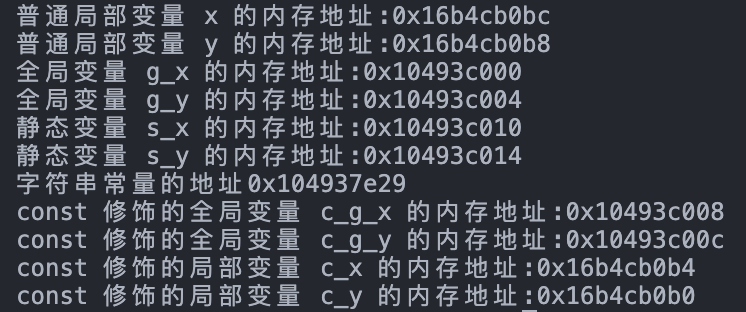
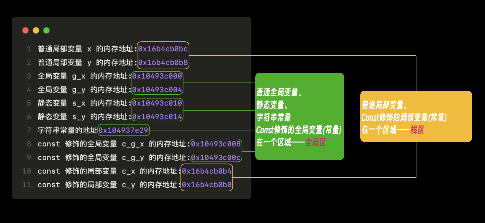
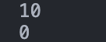
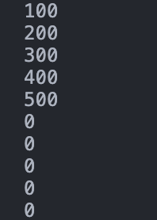
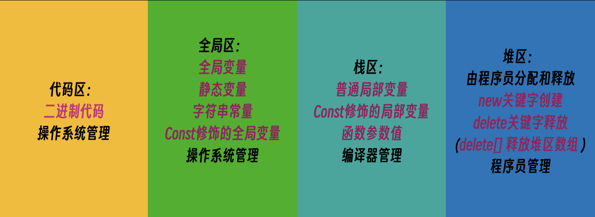

# 内存模型&引用

## 内存模型

C++内存模型大体上可以分为四个区域，代码区、全局区、栈区和堆区，他们分别有各自的作用。（一些书籍也会分为五大分区，更加细致一些）

分区大体上如下：

- 代码区：存放函数体的二进制代码，由操作系统管理
- 全局区：存放全局变量、静态变量、常量。
- 栈区：由编译器来分配和释放，存放函数的参数值、局部变量等。
- 堆区：由程序员分配和释放，程序员如果没有释放，则由操作系统收回。

## 内存详细说明

我们可以把程序按照时间分为程序运行前和程序运行后来分段说明，

### 程序运行前：

程序运行前指的是，程序源代码编写完并编译完成后，已经生成了可执行程序，但还未执行程序。

此时的内存：

- 代码区：
    1. 存放了CPU可执行的机器指令。
    2. 代码区是共享的，其目的是对需要频繁被执行的程序，只需要在内存中有一份代码即可。
    3. 代码区是只读的，目的是防止程序意外修改了指令(保证安全性)

- 全局区：
    1. **全局变量**和**静态变量**在这个区
    2. **字符串常量**和 **const 修饰的全局变量**
    3. 程序运行结束后由系统释放

**代码测试：**

```cpp
#include <iostream>
using namespace std;

// 全局变量
int g_x = 100;
int g_y = 200;

// const 修饰的全局变量
int c_g_x = 10;
int c_g_y = 20;

int main()
{
    // 普通局部变量
    int x = 10;
    int y = 20;

    // 输出普通局部变量的内存地址
    cout << "普通局部变量 x 的内存地址:" << &x << endl;
    cout << "普通局部变量 y 的内存地址:" << &y << endl;

    // 输出全局变量的内存地址
    cout << "全局变量 g_x 的内存地址:" << &g_x << endl;
    cout << "全局变量 g_y 的内存地址:" << &g_y << endl;

    // 静态变量，普通变量前加上 static 关键字就是静态变量
    static int s_x = 1000;
    static int s_y = 2000;

    // 输出静态变量的内存地址
    cout << "静态变量 s_x 的内存地址:" << &s_x << endl;
    cout << "静态变量 s_y 的内存地址:" << &s_y << endl;

    // 输出字符串常量的内存地址
    cout << "字符串常量的地址" << &"hello" << endl;

    // 输出 const 修饰的全局变量的内存地址
    cout << "const 修饰的全局变量 c_g_x 的内存地址:" << &c_g_x << endl;
    cout << "const 修饰的全局变量 c_g_y 的内存地址:" << &c_g_y << endl;

    // const 修饰的局部变量
    const int c_x = 100;
    const int c_y = 200;

    // 输出 const 修饰的局部变量的地址
    cout << "const 修饰的局部变量 c_x 的内存地址:" << &c_x << endl;
    cout << "const 修饰的局部变量 c_y 的内存地址:" << &c_y << endl;
}
```

**运行结果：**





### 程序运行后：

程序编译完之后的可执行程序执行。

- **栈区：**
    1. 栈区由编译器自动分配和释放，存放**函数的参数值**，**局部变量**，**const 修饰的局部变量**
    2. 注意**不要返回局部变量的地址**，因为函数运行完之后编译器自动释放。

由上个代码可以看到**普通局部变量**以及**const修饰的局部变量(常量)**在栈区。

**代码测试：**（不要返回局部变量的地址）

```cpp
#include <iostream>
using namespace std;

// 局部变量存储在栈区
int *func() // 返回的是地址，因此返回值类型是指针类型 加上 * 号
{
    int a = 10;
    return &a; // 返回局部变量地址
}

int main()
{
    int *p = func(); // 因为函数返回的是地址，因此需要指针来接收
    cout << *p << endl;

    return 0;
}
```

**运行结果：**


运行结果报错，这是因为在栈区开辟内存是由编译器自动释放的，在函数运行结束之后则自动释放掉了，因此不能返回地址。

- **堆区：**
    1. 由程序员分配和释放
    2. C++中主要使用 `new`  关键字在堆区开辟内存
    3. 使用 `delete`  关键字在堆区释放内存

**代码测试：**（new关键字创建堆区数据）

```cpp
#include <iostream>
using namespace std;

// 堆区内存由自己创建自己释放
int *func()
{
    // 使用 new 关键字把数据创建到堆区
    int *p = new int(10); // new 关键字返回的是堆区的地址，因此使用指针接收
    return p;             // p是指针，里面存储了堆区的地址，因此函数返回值类型需要加上 * 号
}

int main()
{
    int *p = func();    // 调用函数,因为返回的是地址，因此使用指针接收
    cout << *p << endl; // p 是指针，想要查看指针指向的地址中的数据需要解开

    return 0;
}
```

**运行结果：**


**代码测试：**（delete关键字释放堆区内存）

```cpp
#include <iostream>
using namespace std;

// 堆区内存由自己创建自己释放
int *func()
{
    // 使用 new 关键字把数据创建到堆区
    int *p = new int(10); // new 关键字返回的是堆区的地址，因此使用指针接收
    return p;             // p是指针，里面存储了堆区的地址，因此函数返回值类型需要加上 * 号
}

int main()
{
    int *p = func();    // 调用函数,因为返回的是地址，因此使用指针接收
    cout << *p << endl; // p 是指针，想要查看指针指向的地址中的数据需要解开

    // 释放堆区数据
    delete p;
    cout << *p << endl; // 查看堆区内存释放之后这块内存中的数据

    return 0;
}
```

**运行结果：**



**在堆区创建一个数组**

```cpp
#include <iostream>
using namespace std;

int main()
{
    // 在堆区创建一个数组
    int *arr = new int[5]; // 数组的元素类型是 int 数组需要长度，因此需要[5]
    // 为数组中添加数据
    for (int i = 0; i < 5; i++)
    {
        arr[i] = (i + 1) * 100; // 添加 100、200、300、400、500到数组中
    }
    // 输出数组中的内容查看
    for (int i = 0; i < 5; i++)
    {
        cout << arr[i] << endl;
    }

    // 释放堆区中的数组
    delete[] arr; // 注意：释放堆区中的数组数据 delete 关键字后需要加上 []

    // 堆区数组释放之后再输出数组测试
    for (int i = 0; i < 5; i++)
    {
        cout << arr[i] << endl;
    }

    return 0;
}
```

**运行结果：**



## 总结




## 引用

待更新...


