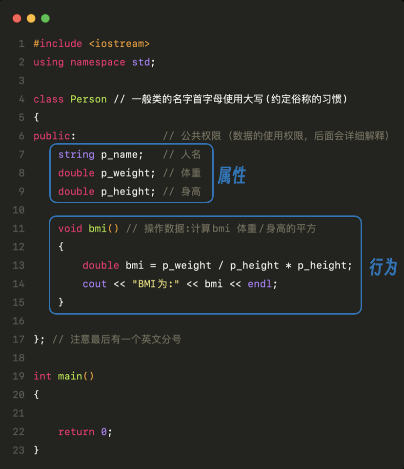
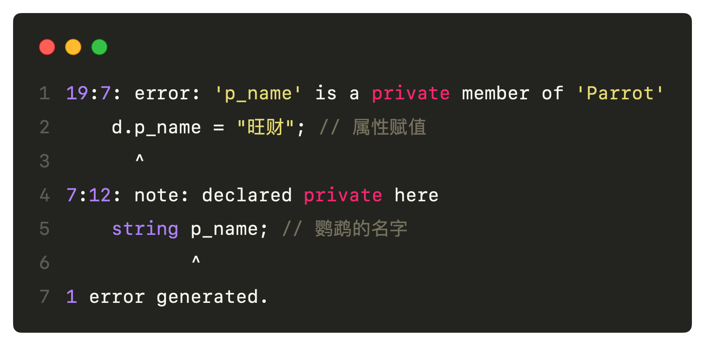

# 类和面向对象

## 概念理解

日常生活中，我们会把一些事物进行分类，比如 **动物**、**花**、**人**、**电器** 等等

这些词汇都是抽象的，并不代表某一个具体的事物，这里以人来举例：

**人** 是一个抽象的概念

**张三** 是一个具体的人

在**面向对象**这种编程思想中，我们把这种抽象的概念用 **类** 来表达，把 **类** 的具体事物用 **实例/对象** 来表达。

## 类的创建和使用

### 类的创建

- 语法：

```cpp
class 类名{ 访问权限： 属性 / 行为};
```

- 例子：

设计一个人类

```cpp
#include <iostream>
using namespace std;

class Person // 一般类的名字首字母使用大写(约定俗称的习惯)
{
public:              // 公共权限 （数据的使用权限，后面会详细解释）
    string p_name;   // 人名
    double p_weight; // 体重
    double p_height; // 身高

    void bmi() // 操作数据:计算bmi 体重/身高的平方
    {
        double bmi = p_weight / p_height * p_height;
        cout << "BMI为:" << bmi << endl;
    }

}; // 注意最后有一个英文分号

int main()
{

    return 0;
}
```



在面向对象这种编程思想中，首先考虑的是数据以及数据的使用方法，组成数据的基本单元一般称为 **属性**，操作数据的方法一般称为 **行为** 。把属性和行为作为一个整体来表示某一类事物，这便是类的一个最大的特性——**封装**。封装的优势除了可以把属性和行为放在一起表现一类事物，还可以对属性和行为加上 **权限** 。

### 类的使用

类是一个抽象的概念，并不具体代表某个事物，因此在使用类的时候首先需要做的就是实例化具体的对象。

依旧以上面的代码为例

```cpp
#include <iostream>
using namespace std;

class Person // 一般类的名字首字母使用大写(约定俗称的习惯)
{
public:              // 公共权限 （数据的使用权限，后面会详细解释）
    string p_name;   // 人名
    double p_weight; // 体重
    double p_height; // 身高

    void bmi() // 操作数据:计算bmi 体重/身高的平方
    {
        double bmi = p_weight / (p_height * p_height);
        cout << "BMI为:" << bmi << endl;
    }

}; // 注意最后有一个英文分号

int main()
{
    Person p;          // 实例化对象，取名为 p
    p.p_weight = 45.0; // 为实例对象属性赋值
    p.p_height = 1.73; // 为实例对象属性赋值
    p.bmi();           // 实例对象调用行为函数
    return 0;
}
```

类可以理解为一种新的数据类型，创建一个整型变量，代码是 `int a;` ，实例化某个类的具体对象时，也是如此。

`Person p` , 即 `类名 对象名` ，这样就是创建出了一个具体的类的对象。

类中的属性可以通过点标记法来赋值，按照类属性的数据类型来赋值即可。

## 访问权限

访问权限有三个，分别是:

- `public`：公共权限，成员类内可以访问，类外也可以访问
- `protected`：保护权限，成员类内和派生类可以访问，类外不可以访问
- `private`：私有权限，成员类内可以访问，类外不可以访问

这里提到一个词汇“成员”，所谓的“成员”是一个泛指的概念，用来表示类或对象所拥有的组成部分，比如属性可以叫做数据成员，类的行为可以叫做成员函数。

所谓的类内和类外表示的就是类的大括号，在大括号内即类内，大括号外就是类外。

在这三个权限中，`protected` 权限是比较特殊的，它是本身类内可以访问，类外不可以访问，但是如果是它的派生类也是可以访问的，后续在说明**继承**概念的时候会详细说明。

下面通过代码说明 `public` 和 `private` 。

```cpp
#include <iostream>
using namespace std;

class Parrot // 鹦鹉类
{
public:
    string p_name; // 鹦鹉的名字

    void speak() // 鹦鹉的行为——说话
    {
        cout << "我叫" << p_name << endl; // 类内访问成员属性 p_name
    }
};

int main()
{
    Parrot d;          // 实例化一个 Parrot 对象
    d.p_name = "旺财"; // 属性赋值
    d.speak();         // 调用成员函数

    return 0;
}
```

在这段代码中，类 `Parrot` 的成员属性和成员函数都是在 `public` 权限下的，因此都可以不管类内、类外都是可以访问到的。

<br/>
把代码稍作修改，给 `p_name`  添加私有权限:

```cpp
#include <iostream>
using namespace std;

class Parrot // 鹦鹉类
{
private:           // 私有权限
    string p_name; // 鹦鹉的名字

public:          // 公共权限
    void speak() // 鹦鹉的行为——说话
    {
        cout << "我叫" << p_name << endl; // 类内访问成员属性 p_name
    }
};

int main()
{
    Parrot d;          // 实例化一个 Parrot 对象
    d.p_name = "旺财"; // 属性赋值
    d.speak();         // 调用成员函数

    return 0;
}
```

运行结果：



此时并不影响类内的成员函数使用它，但是这段代码中的`d.p_name = "旺财";` 已经不能赋值了。因为私有权限类外是不可以访问的。

<br/>

把程序中的 `d.p_name = "旺财";` 注释掉:

```cpp
#include <iostream>
using namespace std;

class Parrot // 鹦鹉类
{
private:           // 私有权限
    string p_name; // 鹦鹉的名字

public:          // 公共权限
    void speak() // 鹦鹉的行为——说话
    {
        cout << "我叫" << p_name << endl; // 类内访问成员属性 p_name
    }
};

int main()
{
    Parrot d; // 实例化一个 Parrot 对象
    // d.p_name = "旺财"; // 属性赋值
    d.speak(); // 调用成员函数

    return 0;
}
```

运行程序：


得到这个结果是因为没有给属性赋值，`speak()` 成员函数是公共权限依旧可以在类外使用的。由于 `p_name` 并没有被赋值，`string类型` 在没赋值的情况下默认为空，因此 `p_name` 为空，最后只输出显示出了 `我叫` 。

**注意：在类中定义属性、方法默认都是 private 权限**

## 成员属性私有化

待更新...
