# 环境搭建&基础知识

大家好，欢迎来到《从0开始的Python基础课》第0期，

在本系列中我将带领大家完全从0开始学习 Python 。


在观看学习本系列之前，我希望你已经搜索了解了 Python 是什么以及它的历史。

好了，废话不多说，我们直接开始：

## 引入

这是一段 Python 的代码，通过解释器运行之后，会在终端中显示出 `hello, world` 。

```python
print("hello, world")
```

这段看似简单的代码，几乎包含了 Python 学习中必不可少的入门知识点，比如代码是什么？解释器是什么？终端是什么？代码是怎么运行的？等等等等。


你可以在任何可以编写文字的地方编写这段代码，比如在 `Mac OS` 系统中可以使用 `文本编辑` 软件，

`Windows` 系统中可以使用 `记事本` 软件，编写这段代码，然后将它保存下来。如果是在 `Mac` 系统中则默认它的文件后缀名是 `.rtf` ，如果你看不到文件后缀名则可以找到访达中的设置把 `显示所有文件扩展名` 勾选上，

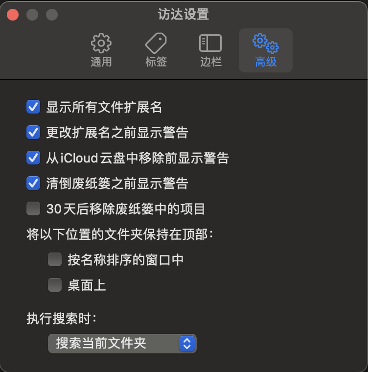

如果你使用的是 `Windows` 系统，则记事本默认的文件后缀名是 `.txt` ，无论是哪个系统，我们想要打开这个编写的文件，那么大概还是会用 `文本编辑` 软件来打开它。

`Python` 的文件格式后缀名是 `.py` ，想要打开它，则同样需要对应的“软件”才能打开，这个“软件”就是

 `Python` 解释器了，Python 解释器有很多，官方的 `Python` 解释器是 `CPython` 。因此想要编写

 `Python` 代码并运行它则首先下载安装一个 `Python` 解释器是必不可少的啦。

## 安装Python官方解释器

首先打开 `Python` 的官网 https://www.python.org/

把鼠标移动到 Downloads 上即可看到你当前系统对应的 `Python` 。把它下载下来，然后双击开始安装，Windows 系统在安装时需要注意在第一个界面中把 `add to Path` 勾选上，其他的全部选择默认下一步安装即可。MacOS 的朋友可以不用安装 `Python`，因为 MacOS 系统本身自带了 `Python` 解释器。


安装好 `Python` 之后，Windows 系统的朋友打开搜索框，搜索 `powershell` 打开它，MacOS 的朋友在启动台搜索框中搜索 `终端` 打开它。为了方便称呼，无论是 `Windows系统` 还是 `MacOS` 未来我们统一称这个黑窗口为 `Terminal` 或 `终端`，在窗口中输入 `python`，然后回车，会出现这样的界面即表示 `Python` 安装成功啦。

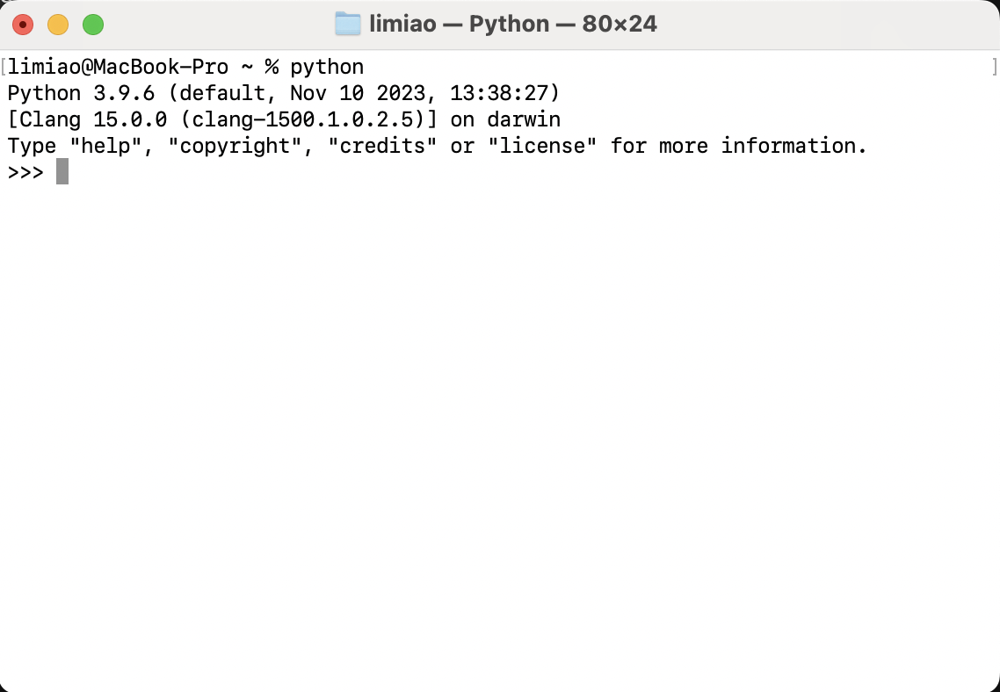

这个界面中显示了 `Python 3.9.6` ，其中第一个数字3是 `Python` 的大版本号，第二个数字是中版本号，最后一个是小版本号，此时大家下载的版本和我这里展示的版本可能并不一致，这是没有关系，基础阶段学习我们只需要关注大版本号是否为3就可以了，未来需要使用到不同版本的 `Python` 时，我们可以使用 `Pyenv` 来安装多个版本的 `Python` 。

这个带有三个大于号的界面是 `Python` 的交互式界面，所谓的交互式界面就像是我们交流时的对话一样，我说一句你说一句，比如我们在这里输入 `1+1` 然后回车，它就会给我们回复一个数字 `2` 。这就是交互界面。

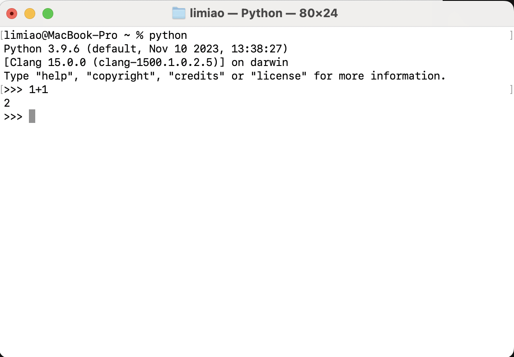

## 安装代码编辑器

当然关闭这个界面我们所写的任何代码也就不在了，因此我们需要找到一个类似 `文本编辑` 的软件来编写代码，有很多可以用来编写 `Python` 代码的编辑器，比如 Pycharm 、VS Code 等等等等。这里我选用免费开源的 `VS Code`，打开 `VS Code` 的官网，下载安装即可。

安装完成打开 `VS Code` ，界面可能是英文的，如果想要把界面改为中文，则可以点击左侧扩展位置再在搜索框中搜索 `Chinese` 安装这个插件之后重启软件即可。

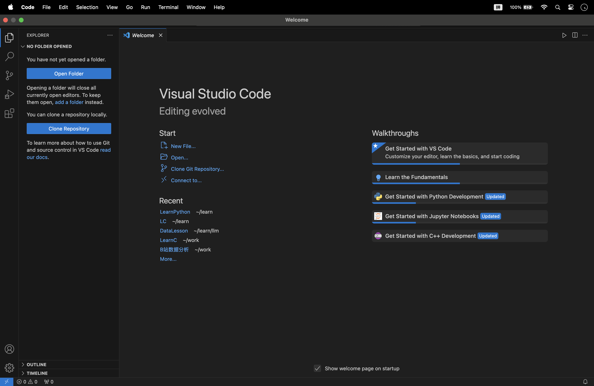

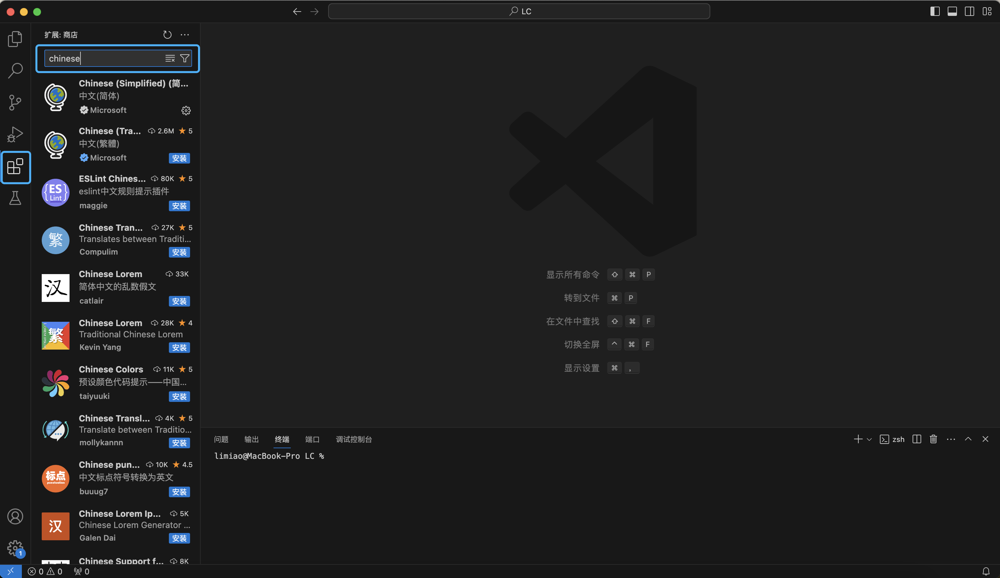


## 尝试编写代码

接下来我们来编写之前的这段代码，首先为了方便管理代码，可以在任意位置创建一个文件夹专门用来存储我们编写的 `Python` 代码，比如我这里专门创建了一个名为 `LearnPython` 的文件夹。

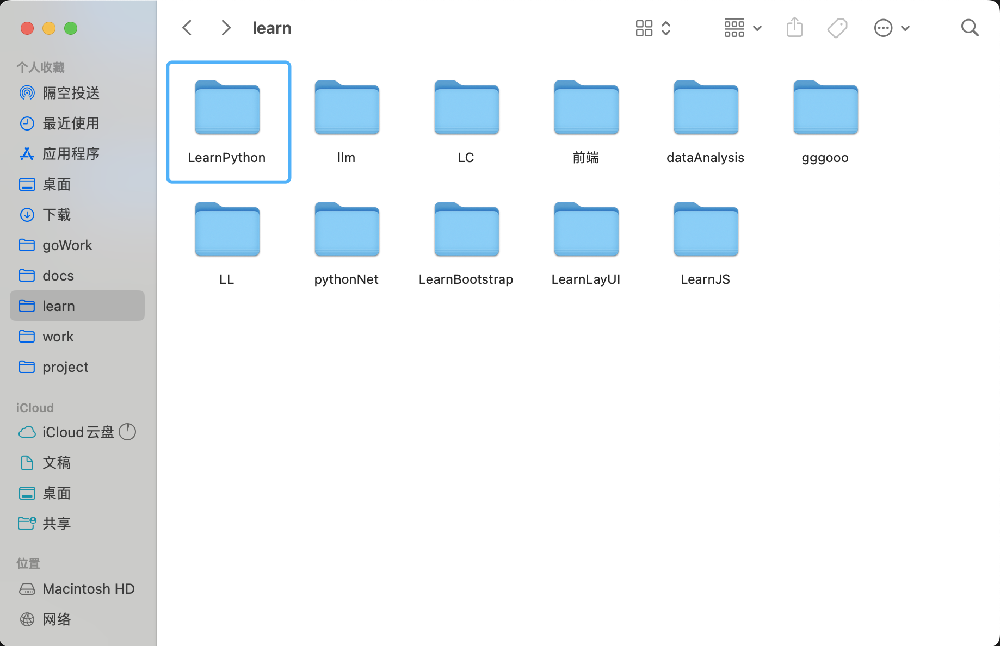


回到 `VSCode` 中，从 `菜单栏` 中的 `文件` 下找到 `打开文件夹` 然后在弹出框中找到刚才创建的 `LearnPython` 文件夹，选择这个文件夹打开。

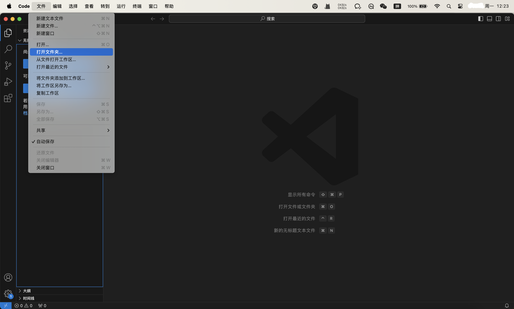

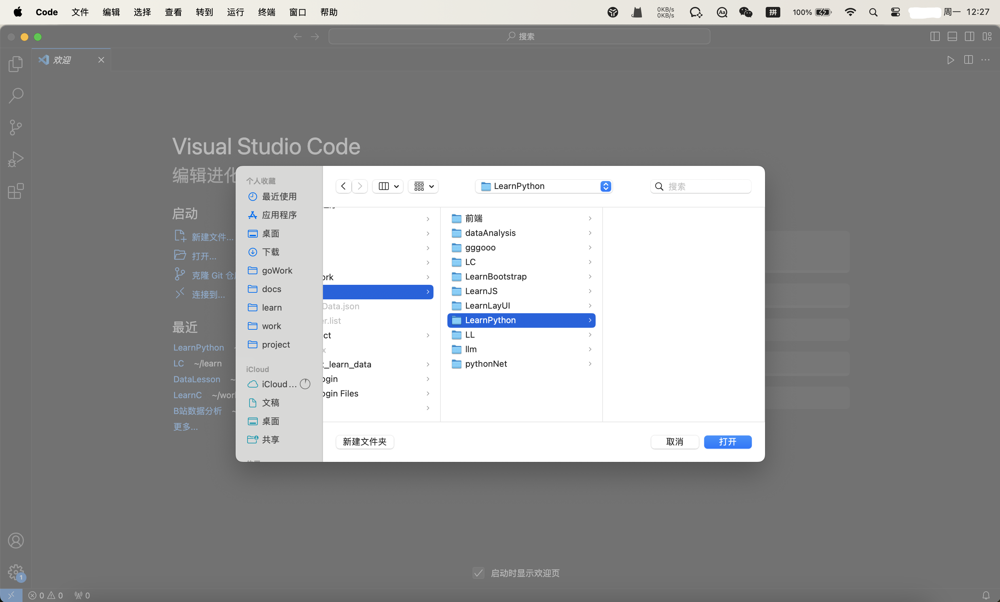

点击文件夹名称旁边的第一个新建文件按钮图标，取名为 `hello.py` 。

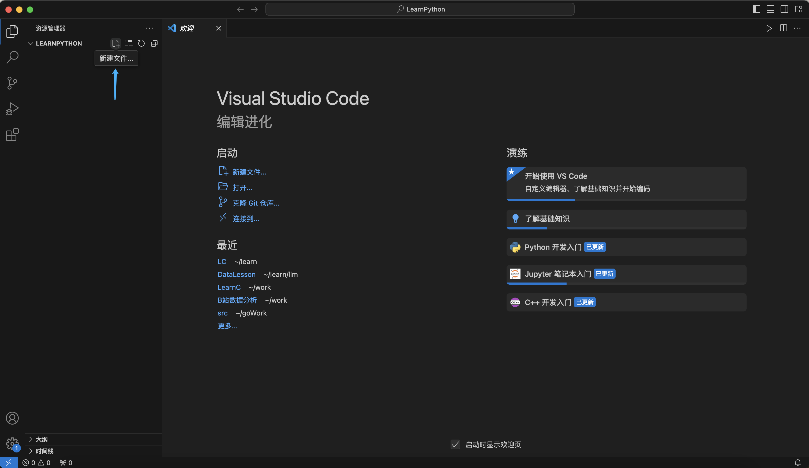

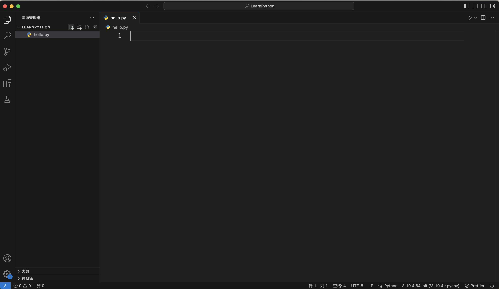

然后在这个文件中编写代码:

```python
print("hello world")
```

保存代码，然后在右上角找到三角形的运行按钮，点击按钮右侧的倒三角找到 `在专用终端中运行Python文件` 

就可以在编辑器代码区的下方看到运行结果了。

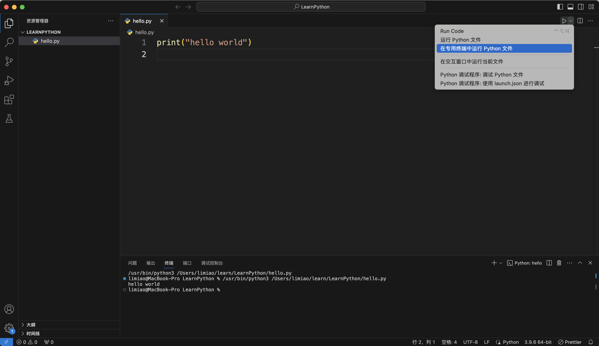


## print()作用和字符串

这段代码运行之后在终端打印出了 `hello world` 文字。可以尝试修改代码中双引号里的内容再次运行程序查看结果，比如修改为 `"hello Python"` ，再运行程序。

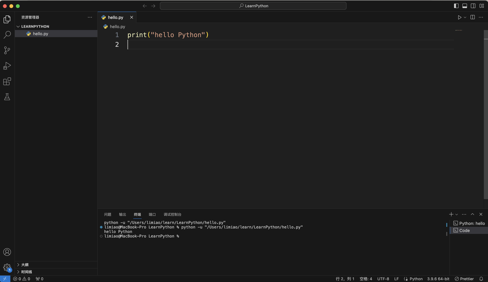

会发现修改双引号中的内容为什么，运行程序就会显示出什么。这就是 `print()` 的作用，print 英文单词本身的意思是 `打印` 。这里 `print()` 的作用就是把括号中的内容打印到终端。有的朋友可能会问，刚才的代码中的 `print()` 中的文字还有一对双引号，为什么没有打印到终端呢？这是因为在 `Python` 中这种被一对英文引号包裹的数据被称为字符串，这对英文引号可以认为是字符串的一种标志，如果想要在终端显示出引号，则需要再写一对引号，但是注意不能在双引号里面再次使用双引号，可以使用单引号，比如这样

```python
print("'hello Python'")
```

  

运行结果就是这样的了。

如果想要显示双引号，则可以反过来，在外面使用单引号，在里面使用双引号，像这样

```python
print('"hello Python"')
```


运行结果就是这样带有双引号的了。关于字符串的内容未来会再单独详细说明。


既然 print() 可以把括号中的内容打印出来，那么是不是意味着我们可以使用它打印任何内容呢？比如打印数字，

我们可以尝试一下。

```python
print(123)
```

运行结果：


果然可以打印出数字。

## 编写多行代码

到这里， `print()` 的功能我们就了解得差不多了。目前为止，我们编写的代码还只有一行，如何编写多行代码呢？假如我们想要一次打印出两行 `hello world` ，应该怎么编写代码呢？

只需要换行在下面再写一行即可

```python
print("hello world")
print("hello world")
```

需要注意的是 `Python` 是以换行作为一行代码的结束，因此如果要写下一句代码，则需要换行另起一行而不是继续在同一行继续写，如果继续写则会报语法错误。

```python
print("hello world")print("hello world")
```

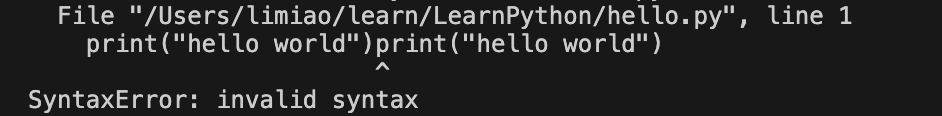

## Python的报错提示

`Python` 的报错提示还是非常智能的，比如这个错误，首先看报错的最后一行，它提示了是 `SyntaxError` 即语法错误，`invalid syntax` 无效的语法。然后再往上看，会看到 `line 1` ，这是提示了错误在哪一行，下面还用小尖尖指到了错误的具体位置，让我们能很快的找到错误。


## 程序注释

接下来我们来讲一下注释，注释就是对代码的解释和说明，它的作用就是可以让人更好的理解代码，提高代码的可读性。

这是 Python 官方代码中的注释：

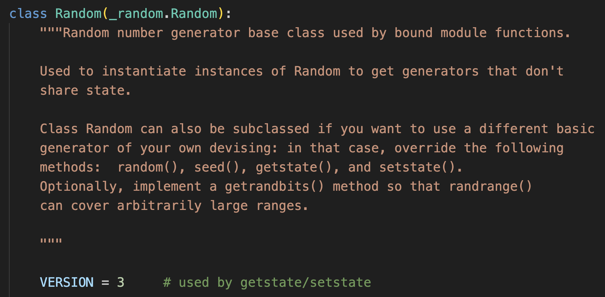

`Python` 的注释分为两种，单行注释和多行注释，单行注释使用 `#` 号，在 `#` 之后的内容不会被 `Python` 解释器执行。多行注释使用一对 `三引号`，在这对 三引号 中间的内容不会被解释器执行。

我们可以尝试一下：

```python
# 使用print()打印"hello world"字符串
print("hello world")
```

运行这段代码，没有报错，并且和之前没有写注释时运行这段代码显示的一样。注释可以像这样写在单独的一行，也可以写在某行代码之后，比如这样，也是不影响程序运行的。

```python
print("hello world") # 使用print()打印"hello world"字符串
```

多行注释则可以一次编写多行内容，比如这样，使用英文三引号。

```python
"""
这篇代码由 LetsLearning 频道编写
主要用来教学 print() 和 字符串以及注释的使用
"""
print("hello world")
print("hello world")
'''
这篇代码由 LetsLearning 频道编写
主要用来教学 print() 和 字符串以及注释的使用
'''
print("hello world")
print("hello world")
```


## 三引号包裹的字符串

还记得刚才我们提到字符串的标志吗，字符串就是一对英文引号包裹起来的，双引号和单引号都可以，那么使用三引号呢？三引号当然也可以，三引号的功能是可以一次写多行，比如

```python
print("""
    hello world
    hello world
    hello world
      """)
```

运行结果

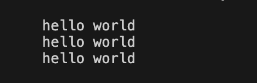

，所以三引号不仅可以用作多行注释，也可以用作字符串的符号。


在很多网站的网页中都隐藏着一些“彩蛋”信息，比如知乎，在知乎的网页中点击鼠标右键，选择检查，这个界面叫浏览器控制台，在这里找到 `Console` ，点击它即可看到这样的一幅使用字符构成的图案，可以把这个图案复制下来，然后粘贴到字符串的三引号中。

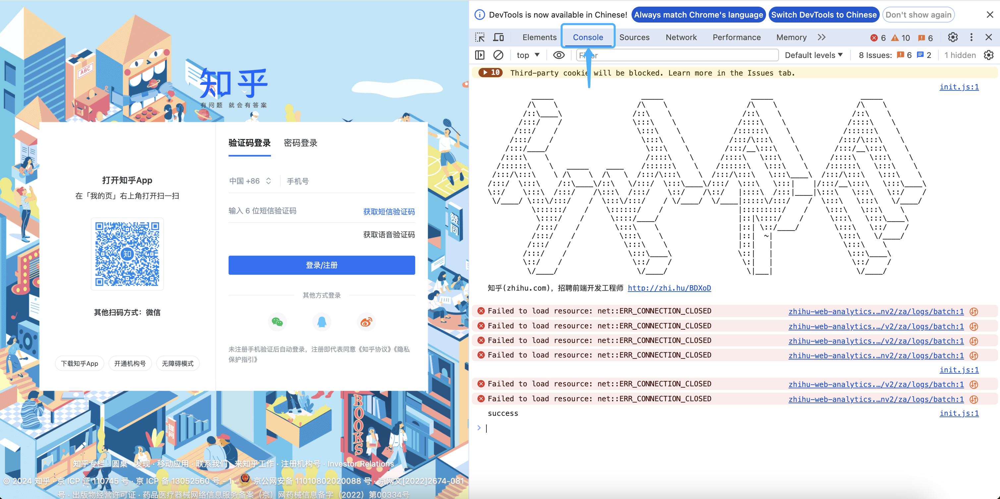

```python
print("""
          _____                    _____                    _____                    _____          
         /\    \                  /\    \                  /\    \                  /\    \         
        /::\____\                /::\    \                /::\    \                /::\    \        
       /:::/    /                \:::\    \              /::::\    \              /::::\    \       
      /:::/    /                  \:::\    \            /::::::\    \            /::::::\    \      
     /:::/    /                    \:::\    \          /:::/\:::\    \          /:::/\:::\    \     
    /:::/____/                      \:::\    \        /:::/__\:::\    \        /:::/__\:::\    \    
   /::::\    \                      /::::\    \      /::::\   \:::\    \      /::::\   \:::\    \   
  /::::::\    \   _____    ____    /::::::\    \    /::::::\   \:::\    \    /::::::\   \:::\    \  
 /:::/\:::\    \ /\    \  /\   \  /:::/\:::\    \  /:::/\:::\   \:::\____\  /:::/\:::\   \:::\    \ 
/:::/  \:::\    /::\____\/::\   \/:::/  \:::\____\/:::/  \:::\   \:::|    |/:::/__\:::\   \:::\____\::/    \:::\  /:::/    /\:::\  /:::/    \::/    /\::/   |::::\  /:::|____|\:::\   \:::\   \::/    /
 \/____/ \:::\/:::/    /  \:::\/:::/    / \/____/  \/____|:::::\/:::/    /  \:::\   \:::\   \/____/ 
          \::::::/    /    \::::::/    /                 |:::::::::/    /    \:::\   \:::\    \     
           \::::/    /      \::::/____/                  |::|\::::/    /      \:::\   \:::\____\    
           /:::/    /        \:::\    \                  |::| \::/____/        \:::\   \::/    /    
          /:::/    /          \:::\    \                 |::|  ~|               \:::\   \/____/     
         /:::/    /            \:::\    \                |::|   |                \:::\    \         
        /:::/    /              \:::\____\               \::|   |                 \:::\____\        
        \::/    /                \::/    /                \:|   |                  \::/    /        
         \/____/                  \/____/                  \|___|                   \/____/ 
""")
```

运行程序，即可看到这个图案被打印出来了，利用三引号的这个特性，还可以自己尝试去绘制一些字符画。


## 总结

好了，以上就是本期的所有内容了，本期是Python系列视频的第0期，知识点比较细小零碎，主要搭建了 `Python` 的编程环境、尝试编写了一个简单的语句 print("hello world")，学习了它的用法，了解了Python中的一种数据——字符串，以及学习了Python中的注释。


最后，如果觉得做的不错的话，欢迎关注～

下期见～