# 变量&基础数据类型

我们都知道计算机中有一个必不可少的硬件——内存，程序在运行时的数据都需要先从外存(硬盘)加载到内存中才可以正确运行。假设计算机是一个国家，操作系统就是国务院，内存就像是这个国家的土地，为了方便管理这片土地，于是给每一块土地编上了号，称为地址，我们创建的数据会被存放在这里，假设现在内存以及地址编号是这样的：

| 0x0000 | 0x0003 | 0x0006 |
| ------ | ------ | ------ |
| 0x0001 | 0x0004 | 0x0007 |
| 0x0002 | 0x0005 | 0x0008 |

在0x0004和0x0008这两块地址上各存放一个数字10，

| 0x0000 | 0x0003           | 0x0006           |
| ------ | ---------------- | ---------------- |
| 0x0001 | 0x0004        10 | 0x0007           |
| 0x0002 | 0x0005           | 0x0008        10 |

需要注意的是这两个地址中存储的数据虽然都是10，但是这两个10并不是同一个。

此时想要操作0x0004上的数字10，则需要通过0x0004这个地址编号来操作，但是地址编号又长又很多看起来密密麻麻的，在编程的时候不方便使用，于是就有了变量。


大家好，欢迎来到《从0开始的Python基础课》第1期，本期我们来学习变量这个知识点。

## 变量

### 变量的定义

变量的名字是自己取的，比如 `my_age` ，因此很方便操作，比如这个数字 `10`，想要使用变量来存储它，则可以写成 `my_age = 10` ，`=` 号在 `Python` 中被称为赋值运算符，意思是把数字 `10` 放到变量 `my_age` 中，这个过程叫做赋值。

很多书籍和课程中会形象的解释变量像盒子一样，用来存储数据的。但通过刚才我们对内存的了解知道数据其实是存储在内存的，那么变量是什么呢？

在 `Python` 中，变量是对内存地址的引用，可以理解为变量中存储的是内存地址，而并不是真实的数据。比如

`age = 10` 实际这个变量存储的是数字 `10` 所在的那块内存地址。关于这一点我们待会儿再继续去解释和验证。

变量定义的具体格式为：

```
变量名 = 任意数据类型的值
```

变量名是自己取的，但是注意哦，并不是随便怎么取都可以，需要遵循一定的规则，它必须是数字、字母、下划线组成的，不可以是数字开头，

比如 `my_name` 是可以的， `1my_age` 是不可以的，因为是以数字开头了。数字、字母、下划线并不是都要有，比如 `my_name` 就没有数字，数字、字母、下划线随机组合即可，纯字母也可以，比如 `myname` 。其次变量名不可以使用 Python 的保留字，所谓保留字就是 Python 官方已经使用过的一些名字，比如 `True` 、`False` 等等，保留字不需要去记忆，编写变量名字的时候稍微注意点别是 Python 已经使用过的就可以了。


边学边测：以下哪些可以作为变量名？

1. `my_age`
2. `99girl`
3. `myPhoneNumber`
4. `_abc`
5. `_123`
6. `123_abc`

### 变量的重新赋值

变量的 `=` 号是赋值的意思，需要注意它不是数学中代数的表达，完整的表达应该是右边的值赋值给了左边的变量名。

既然是赋值，那么可不可以给变量重新赋一个新的值呢？

我们来尝试一下，先把数字 `10` 赋值给变量 `x` ，把它打印出来，然后再把数字 `20` 赋值给变量 `x` ，再打印变量 `x` 查看结果。 

```python
x = 10
print(x)
x = 20
print(x)
```

运行结果：

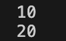

可以看到第一个 `print()` 打印出来的结果是 `10` ，第二个 `print()` 打印出来的结果是 `20` 。变量的值改变了。在 `Python` 中这个操作叫做变量的重新赋值。

从这里也可以看出程序是从上往下一行一行执行的，先执行的代码在运行结果中先显示。在编程中叫做顺序执行。


变量不仅可以重新赋值新的数据，还可以重新赋值变量。比如

```python
x = 10
y = x
print(y)
```

运行结果：

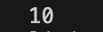

在这段代码中，首先把数字 `10` 赋值给变量 `x` ，第二行代码是把变量 `x` 赋值给变量 `y` ，最后打印结果，结果就是把变量 `x` 的值给了变量 `y` ，因此结果是 `10` 。


定义变量不仅可以一次定义一个，还可以一次定义多个，比如

```python
x, y = 10, 20
print(x)
print(y)
```

运行结果：

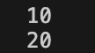

`print()` 也可以一次输出多个，比如这个代码就可以改为

```python
x, y = 10, 20
print(x, y)
```

运行结果：


接下来我们再来看赋值运算符 `=` 号的右边，`=` 右边是变量的值，它可以是任意数据类型的，这里我们需要学习一个新的知识点——数据类型。

## 数据类型

### 认识基本数据类型

为了方便管理数据，把数据分为了不同的类型，比如我们已经见过的数字，还可以分为整数和小数，整数一般我们称为整数类型，使用 `int` 表示。 小数一般我们称为浮点类型，使用 `float` 表示。除了数字之外我们还见过字符串，字符串是使用一对英文引号包括起来的数据，使用 `str` 表示。

除了我们见过的数字和字符串两种数据类型之外，`Python` 还有一个常用基础数据类型——布尔类型，

使用 `bool` 表示，这种类型只有两个值，即 `真` 和 `假` ，`Python` 中 `真` 使用 `True` 表示，`假` 使用 `False` 表示。


我们来创建几个变量分别存储不同的数据类型数据查看一下。

```python
x = 10
y = "10"
z = True
q = 1.23

print(x)
print(y)
print(z)
print(q)
```

运行结果：

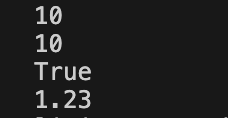

### 查看变量数据类型函数——type()

变量就是用来方便我们操作数据的，可以直接在 `print()` 中打印变量，即可将变量的值打印出来，不知道有没有朋友注意到一个小问题，变量 `x` 中存储的是 `数字 10` ，变量 `y` 中存储的是`字符串 10`，在运行程序之后显示的都是 `10`，我们很难通过运行结果判断出 10 是什么数据类型的，那么该如何查看数据的类型呢？

在 `Python` 中可以使用 `type()` 函数来查看数据的类型，比如查看变量 `x` 的数据类型，则可以在刚才的代码最后加上一句代码：

```python
x = 10
y = "10"
z = True
q = 1.23

print(x)
print(y)
print(z)
print(q)
print(type(x))
```

运行结果：

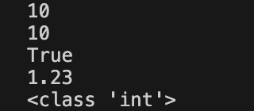

可以看到结果中显示了 `<class 'int'>` ，int 是 Python 中整型的表达。因此可以知道变量 x 中存储的数据是整型，同样的方法可以查看变量 `y` 的数据类型：

```python
x = 10
y = "10"
z = True
q = 1.23

print(x)
print(y)
print(z)
print(q)
print(type(x))
print(type(y))
```

运行结果：

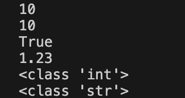

可以看到变量 y 的数据类型是 `str`，即字符串类型。


## 探索变量的本质

### 查看内存地址的方法

到目前为止我们已经知道了变量如何定义和使用，接下来我们回到开始的地方探索一下变量的本质，我们说 

`Python` 中的变量本质上是对地址的引用，变量中实际存储的是数据的地址而不是真实的数据，想要验证这一点，就需要找到数据的真实内存地址是什么，在 `Python` 中可以使用 `id()` 函数查看内存地址。

比如这里有一个变量 `x = 10` ，使用 `id(x)` 即可查看到它的内存地址，使用 `print()` 将它打印出来。

```python
x = 10
print(id(x))
```

运行结果：


需要注意的是，你的代码打印出的结果和我的大概率是不一样的，因为在我的计算机内存中数字 `10` 存储的位置和你的大概率不是在同一块内存地址上。

### 探索变量本质

为了探索变量的本质，我们给 x 重新赋一个新的值：

```python
x = 10
print(id(x))
x = 20
print(id(x))
```

如果运行代码之后，第一个 `print()` 打印出来的结果和第二个 `print()` 打印出来的地址结果一致，

说明 `10` 和 `20` 这两个数据使用的是同一块内存地址存储的，给变量重新赋值相当于是把数字 `10` 修改为了 `20` ，

如果打印出来的结果不一致则意味着变量中存储的数据并不是在同一块内存地址上。来看运行结果：

运行结果：

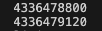

可以看到结果并不一致，验证了在 `Python` 中变量其实存储的并不是真实的数据，而是数据的内存地址。

我们可以进一步探索，定义一个新的变量 `y` , 把变量 `x` 赋值给变量 `y` ，最后打印出变量 `y` 的内存地址：

```python
x = 10
print(id(x))
x = 20
print(id(x))
y = x
print(id(y))
```

如果最后一个 `print()` 打印出的结果和倒数第二个 `print()` 打印的结果一致，说明变量中存储的是地址，第五行代码 `y = x` 其实是把变量 `x` 中存储的地址赋值给了 变量 `y` 。查看打印结果

运行结果：

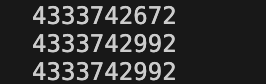

从结果可以看得出后面两个地址是一样的，再一次证实在 `Python` 中变量存储的其实是地址而不是真实的数据。

为了可以更加清晰的展示，我们来绘图整理一下这段代码，首先是有一个数字 `10` ，它存储在内存地址中，

变量 `x` 保存了这个地址

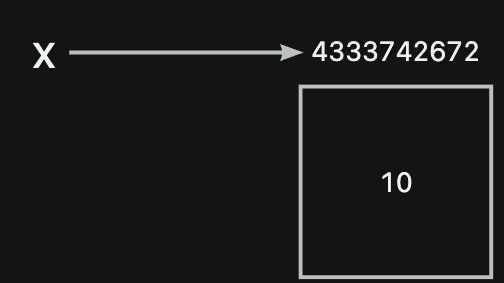

然后有一个数字 `20` ，它存储在另外一块内存中

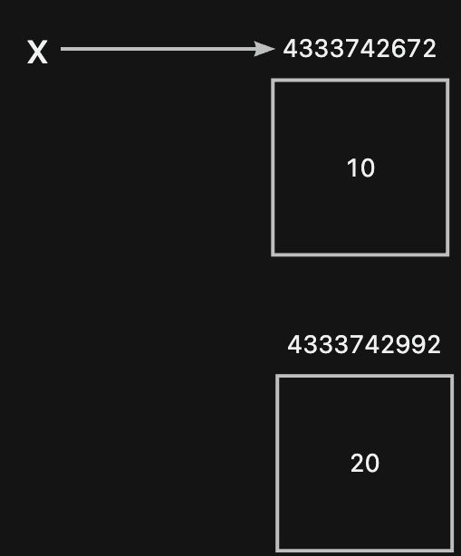

把数字 `20` 赋值给变量 `x` 实际是把它的内存地址给到了 `x` 。

 

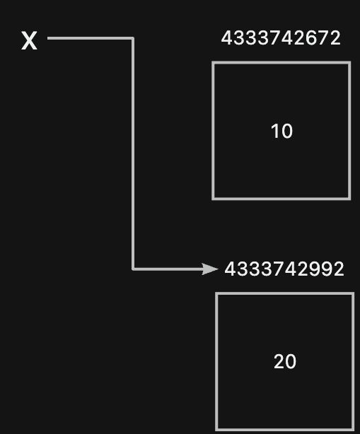

再然后是把变量 `x` 赋值给变量 `y` ，实际是把变量 `x` 中的内存地址赋值给了变量 `y`。

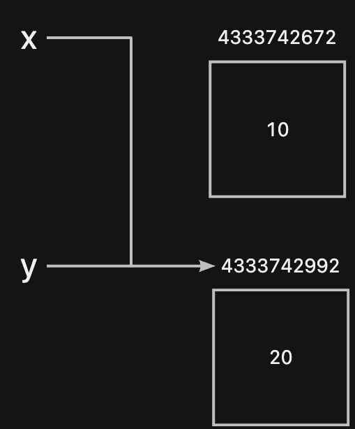

因此实际上变量 `x` 和变量 `y` 中存储的是同一个内存地址。这种实际存储的是内存地址的情况，我们称为引用。可以说变量 `x` 和 变量 `y` 引用了同一块内存。因此修改变量的值实际上是更换了变量的引用，而不是真的修改了内存中存储的那个数据。因此 `x = 10` 这样的一句代码，我们除了可以说“把数字 `10` 赋值给了变量 `x` ”之外，还可以说“变量 `x` 指向了数字 `10` 的内存地址”。

<br>

好了，以上就是本节的内容了，我们学习了变量的定义、了解了基础的数据类型，有整型、浮点型、字符串、和布尔类型，最后探索了 `Python` 中变量的本质。多说一点关于代码的编写规范，比如在编写变量赋值的时候，我们写的是 `x = 10` ，在 `=` 号的两侧各留有一个空格，如果不加这两个空格也是符合语法的，但是为了让代码编写得更加清晰，因此制定了一些人为规范，一般会在 `=` 号的两侧各增加一个空格。


最后我们来做一些练习：

1. 下面代码中两个 print() 打印的结果是否一致？

```python
x = 10
print(id(x))
x = 20
y = x
print(id(y))
```

2. `True001` 是否是一个正确的变量命名？

3. 下面代码运行结果是

```python
x = 10
y = x
x = y
y = 20
x = y
print(x)
```

4. 变量交换：有变量 `x` 和变量 `y`，分别存储了数字 `10` 和数字 `20`，要求编写代码交换两个变量的值。

```python
x = 10
y = 20
```


<br>

好了，以上就是本期的所有内容了，如果觉得对你有所帮助的话，欢迎关注，我们下期再见～拜拜～