# 输入输出 & 运算符 & 数据类型转换

## 引入

BMI 是国际上常用的衡量人体胖瘦程度以及是否健康的一个标准，简称体质指数，它的通用计算公式为


其中体重的单位是千克，身高的单位是米，比如我的体重是 48 kg，身高是 1.73 m，

那么我的 BMI 则是 


通常体质指数小于18.5属于消瘦，体质指数在18.5到24（包含18.5，包含24）之间则为正常值，超过24则为超重。从 BMI 可以看出我是属于消瘦那一类的，体质指数一定程度上反应了身体的状况，不在正常值的话建议定期去医院体检。

现在要求编写一个 Python 的程序来实现输入体重和身高，程序给我们输出体质指数的值。


大家好，欢迎来到《从0开始的Python基础课》第2期，本节课我们来学习一些新的知识完成计算 BMI 指数小程序。


## 输入

首先来看程序需求，要求可以输入体重和身高，那么肯定需要对应的代码来实现，在 `Python`中实现输入的代码是 `input()` ，`input` 本身单词的意思就是输入，也比较好记忆。

它是怎么使用的呢？可以使用一段代码来展示

```python
x = input()
print(x)
```

使用 `input()` 输入，把输入的值保存在变量 `x` 中，然后再使用 `print()` 打印出来，

运行程序来看看结果：

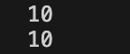

在运行程序之后，会有一个光标停留在终端中等待我们的输入，一般把这个称为阻塞，输入数字 `10` 之后回车，

会立刻显示出数字 `10` 。第二个数字 `10` 是通过 `print()` 打印出来的。一般在终端中打印内容，也可以称为输出。

当然如果只是这样直接输入的话，用户在运行程序之后是并不知道要输入什么内容的，所以我们还需要增加一些输入的信息提示， `input()` 的括号中支持使用字符串来作为信息提示，比如

```python
x = input("请输入体重(kg)：")
print(x)
```

运行结果：

输入前：


输入后：

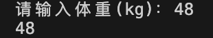


了解了输入 `input()` 的基本用法之后，来实现一下程序的输入

```python
weight = input("请输入你的体重：")
height = input("请输入你的身高：")
print(weight, height)
```

运行结果：

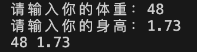


## 算数运算

此时我们完成了程序的输入部分，接下来需要按照公式完成计算， `Python` 是支持算数运算的，和我们所熟知的数学中的算数运算是一样的，只是一些符号不一样，

`Python` 中的加、减、和数学中的符号是一样的，乘法的符号使用一个 `*` 表示，除使用一个 `/` 表示。

| 算数运算符 | 说明   |
| ---------- | ------ |
| +          | 加     |
| -          | 减     |
| *          | 乘     |
| /          | 除     |
| //         | 整除   |
| %          | 取余   |
| **         | 幂运算 |

两个 `//` 表示整除，整除的意思是只保留整数部分，比如 `5 // 2` ,得到的结果是 2，而一个 `/` 的除，则是都保留，编写代码来验证一下：

```python
print(5 // 2)
print(5 / 2)
```

运行结果：

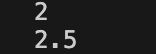

可以看到第一行代码的运行结果是 `2` ，第二行代码的运行结果是 `2.5` 。 


`%` 则表示取余，也叫取模。使用它可以求解两个数相除的余数，比如 `5 % 2` ，得到的结果应该是 1，

因为 `5` 除以 `2` 得到的商是 `2` ，余数是 `1` ， `%` 的作用就是求这个余数的。

编写代码验证一下：

```python
print(5 % 2)
```

运行结果：


最后还有一个是 `**` 这个是幂运算的符号，比如 `2**3` 表达的就是 `2的3次方` 。编写代码来验证一下：

```python
print(2**3)
```

运行结果：


这就是 `Python` 中的算数运算了，这些符号被称为算数运算符。


了解了这些算数运算之后，我们来继续编写程序，根据 BMI 公式


```python
weight = input("请输入你的体重：")
height = input("请输入你的身高：")
BMI = weight / height**2
print(BMI)
```

运行结果：

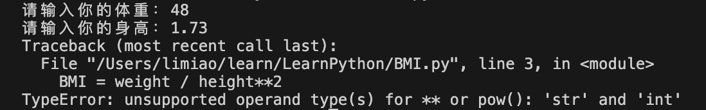


会发现出错了，这是为什么呢？

我们来分析一下报错的信息提示，首先看报错的最后一行，对于幂运算 `**` 不支持运算数类型：'str' 和 'int'。

我们知道 `str` 代表字符串， `int` 代表整型，也就是说不支持字符串和整型进行求幂运算。

代码中只有一个求幂运算—— `height ** 2` 。数字 `2` 显然是整型，按照报错提示只能是变量 `height` 是字符串了，变量 `height` 是我们定义创建的，它保存了 `input()` 输入的身高数据。因此问题出在了

 `input` 这里。 `input` 有一个特性，使用它输入的数据都会变成字符串。

## input()的特性

我们把 `input()` 单独拿出来测试一下，首先创建一个变量 `x` 接收 `input()` 的输入，然后再使用 

`type()` 函数查看它的数据类型，打印出来查看结果。

```python
x = input("输入：")
print(x, type(x))
```

运行结果：

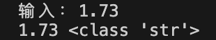

输入了数字 `1.73` ，查看到结果是字符串。说明通过 `input()` 输入的数字会变为字符串。

由于数字和字符串是不能进行求幂运算的，因此需要把字符串数字转化为整型数字或者浮点型数字才可以进行计算。

## 数据类型转换

### 字符串数字转数字

把字符串类型的数据转换为数字类型的数据前提是字符串是数字字符串，比如 `"10"` 、 `"1.73"` ，如果字符串是 `"hello123"` 是不能转换为数字的。

把字符串类型数字转换为数字类型数字非常简单，如果字符串数字是整数，使用 `int()` 函数，如果字符串数字是浮点数类型，使用 `float()` 函数。

编写代码尝试一下：

变量 `x` 中保存了字符串 `"10"`，使用 `int()` 进行转换，把转换后的数据再赋值变量 `x` ，最后打印出变量 `x` 和它的类型。 

```python
x = "10"
x = int(x)
print(x, type(x))
```

运行结果：


通过结果可以看出，变量 `x` 中保存的数据已经是整型了。

再来尝试一下转换字符串小数，使用 `float()` 函数实现。

```python
x = "1.73"
x = float(x)
print(x, type(x))
```

运行结果：


可以看到结果变成了浮点类型。

### 数字类型转字符串类型

到这里有的朋友可能会问，“数字可不可以转换为字符串呢？”，当然也是可以的，使用 `str()` 函数实现。

比如变量 `x` 中保存了数字 10，使用 `str()` 函数转换之后再重新赋值到变量 `x` 中，最后打印出变量 `x` 和它的类型查看：

```python
x = 10
x = str(x)
print(x, type(x))
```

运行结果：

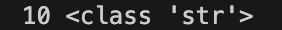

通过结果可以看到已经转换为字符串类型了。

## 输出

知道了数字和字符串类型之间的相互转换，接下来继续完成BMI程序：

```python
weight = input("请输入你的体重：")
height = input("请输入你的身高：")
BMI = weight / height**2
print(BMI)
```

添加两行，注意身高数据是小数，使用 `float()` 转换：

```python
weight = input("请输入你的体重：")
height = input("请输入你的身高：")
weight = int(weight)
height = float(height)
BMI = weight / height**2
print(BMI)
```

这样写程序有点繁琐，其实我们可以直接在 `input()` 输入的时候直接进行转换，把 `input()` 整体放到

`int()` 和 `float()` 中即可：

```python
weight = int(input("请输入你的体重："))
height = float(input("请输入你的身高："))
BMI = weight / height**2
print(BMI)
```

运行程序来测试一下：

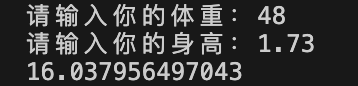

可以看到结果已经计算出来了。结果很长的一个小数，如果我们只想保留三位小数输出结果应该怎么办呢？

这就需要用到格式化输出的知识点了，一起来了解一下。

## 格式化输出

目前 Python 中支持三种格式化输出方式

### %方式

第一种是使用 `%` 的方式 ，它的使用方式我们通过举例来说明：

```python
weight = 48
print("体重是:%d千克" % weight)
```

运行结果：


这种方式会把字符串中的格式化符按照顺序替换成后面的参数。 `%d` 是格式化符，可以理解为 ：`%d` 在为后面的值占位。需要注意的是格式化符需要根据后面值的类型来写，格式化符有很多，一般常用的有 `d` 代表十进制整数，`o` 代表八进制整数， `x` 和 `X` 代表十六进制整数、 `s` 代表字符串， `f` 和 `F` 代表浮点数。

当前我们先理解为这些符号在字符串里是占位的即可，未来随着学习更加深入的时候再去了解它的底层实现方式即可。

再来写一个例子：如果想要一次占多个位置，后面要替换的值需要使用括号括起来。

```python
weight = 48
height = 1.73
print("体重是:%d千克，身高是:%f米" % (weight, height))
```

 运行结果：


通过程序运行的结果我们可以看出，使用 `%f` 占位之后会把要替换的数值转换为小数点后带6位，这是 `%f` 默认的，想要小数点后保留几位小数则需要手动去调整，比如要调整为小数点后保留2位小数，则需要修改为 

`%.2f` 。加入代码测试一下

```python
weight = 48
height = 1.73
print("体重是:%d千克，身高是:%.2f米" % (weight, height))
```

运行结果：

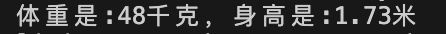


### format方式

第二种是使用 `format()` 函数方式，还是以例子来说明它的使用方法

```python
weight = 48
height = 1.73
print("体重是:{}千克，身高是:{}米".format(weight, height))
```

它是在字符串中使用 ·{}·来进行占位的，然后在 `format()` 的括号中按照顺序写上要填充的值即可。

它其实是在 `{}` 中默认填充了序号，也可以人为添加填充序号，比如:

```python
weight = 48
height = 1.73
print("体重是:{0}千克，身高是:{1}米".format(weight, height))
```

还可以在占位的 `{}` 中使用变量名，比如：

```python
weight = 48
height = 1.73
print("体重是:{w}千克，身高是:{h}米".format(w=weight, h=height))
```

但是这种写法需要注意 `format()` 的括号中是需要手动给占位的变量赋值的。


### f-strings

第三种方式是 `Python3.6` 版本之后才开始有的一种格式化方式，如果你使用的 `Python` 版本低于 `3.6` 就不要使用这种方式了。

这种方式比较简单，通过例子来看：

```python
weight = 48
height = 1.73
print(f"体重是:{weight}千克，身高是:{height}米")
```

直接在字符串前面加上 `f` ，在字符串中使用 `{}` 和 变量的组合来占位即可。


## 完成 BMI 程序

三种都是字符串格式化输出的方式，但是我们发现其实只有第一种使用 `%` 的方式可以实现保留几位小数输出。所以要完成 `BMI程序` 就只能选用 `%` 格式化输出方式了，结果保留三位小数：

```python
weight = int(input("请输入你的体重："))
height = float(input("请输入你的身高："))
BMI = weight / height**2
print("你的BMI数值是:%.3f" % BMI)
```

运行结果：

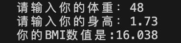


有的朋友可能会思考：“为什么要使用格式化输出的方式来实现呢？不可以直接把变量 BMI 的数值做保留小数位的操作吗？”

当然也是可以的， `Python` 提供了 `round()` 函数可以用来做四舍五入约等的操作，要保留几位小数，则第二个参数写上保留的小数位数就可以了，比如要保留三位小数：

```python
weight = int(input("请输入你的体重："))
height = float(input("请输入你的身高："))
BMI = weight / height**2
BMI = round(BMI, 3)
print("你的BMI数值是:", BMI)
```

运行结果：

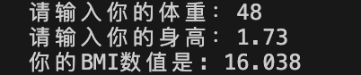


## 小结

以上就是本节的内容了，主要学习了 `Python` 中输入的方法，需要注意 `ipnut()` 得到的输入值都是字符串，还学习了算数运算、字符串数字和数字之间的互相转换，以及字符串格式化输出的三种方式。


## 小节测试

最后，我们来做一些练习

1. 下面代码是否可以正确运行

```python
x = "10"
y = 20
print(x ** y)
```

2. 下面代码是否可以把数字转换为字符串

```python
x = 10
x = str(x)
print(x, type(x))
```

3. 下面代码运行结果是？

```python
x = 10
y = "20"
x = x+int(y)
print(x)
```

4. 下面代码的下划线处应该填入什么代码可以使程序正确运行

```python
x = "10"
x = int(x)
print("x转换之后的结果是_,它的类型是{}".format(x, type(x)))
```

A. %

B. {}

C. {x}

5. 编程题：实现一个加法计算器，用户输入两个数值，计算出结果并打印输出。


好了，以上就是本期的所有内容了，如果觉得对你有所帮助的话，欢迎点关注~我们下期再见～拜拜～