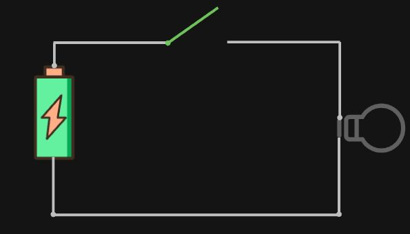
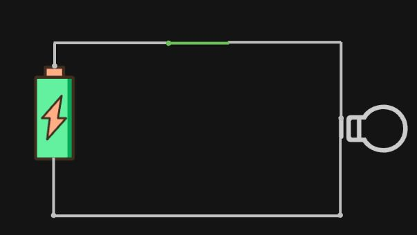
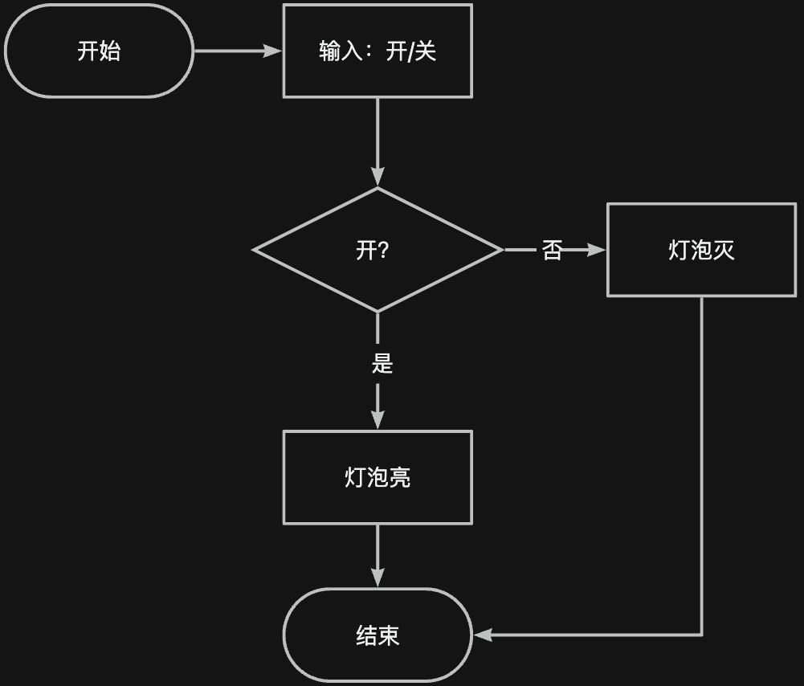
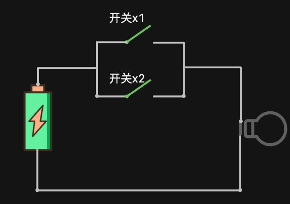
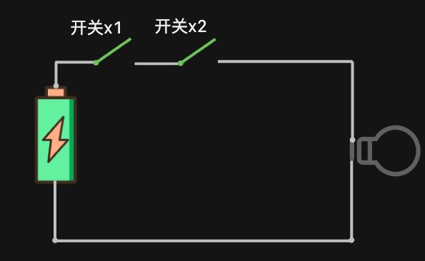

# 分支结构 & 比较运算 & 逻辑运算




这是非常简单的串联电路，如果关上开关，则灯泡亮。

现在有一个需求：要求使用程序模拟电路的开关，如果输入“开”，则输出打印“亮”，如果输入“关”，则输出打印“灭”。要完成这个程序需求就需要学习一个新的知识点——分支判断。


大家好，欢迎来到《从0开始的Python基础课》第3期，本期我们来聊一聊分支判断。


## 分支结构

在此之前我们编写的程序是这样的：（可查看：[>>上一期](./02.md)）

```python
weight = int(input("请输入你的体重："))
height = float(input("请输入你的身高："))
BMI = weight / height**2
BMI = round(BMI, 3)
print("你的BMI数值是:", BMI)
```

程序是由一行一行语句构成的，运行时按照顺序从上往下一行一行执行语句，一般称为顺序结构。

顺序结构虽然可以解决计算、输入输出问题，但不能做判断、选择。对于需要先判断然后再选择的情况就需要分支结构来解决了，比如开关控制灯泡的亮和灭，使用流程图表达是这样的：



这就是典型的分支结构，首先输入“开”或者“关”，然后判断是否是开，如果是开，则灯泡亮，如果不是开，则灯泡灭，最后结束。


在 `Python` 中实现分支结构的语法是这样的：

```python
if 表达式：
    代码块
```

`if` 表示“如果”，表达式指的是使用诸如算数运算符、比较运算符连接的式子，比如 `x > 1` ，这就是一个表达式，所以我们还需要了解一个知识点——比较运算。


## 比较运算

### 比较运算符

`Python` 中比较运算和数学中比较运算基本是一样的，比较两个数的大小，同样有大于、小于、等于这些状态。不同的是 `Python` 中的比较运算符和数学中不太一样。

这些是 `Python` 中的比较运算符：

| 比较运算符 | 说明     |
| ---------- | -------- |
| >          | 大于     |
| <          | 小于     |
| ==         | 等于     |
| >=         | 大于等于 |
| <=         | 小于等于 |
| !=         | 不等于   |

其中需要注意的是 `==` ，它是判断 `==` 左右两边是否相等，而不是使用 `=` ，`=` 在 `Python` 中是赋值运算符。

### 比较运算的结果

比较运算的结果是布尔值，比如 `5 > 4` ，结果是“真”，即 `True` , 这是布尔类型的值，编写一个代码来验证一下：把 `5 > 4` 的比较结果赋值给变量 `x` ，然后打印输出 `x` 的值和它的类型。

```python
x = 5 > 4
print(x, type(x))
```

运行结果：


看到结果是 `True` ，类型是 `bool` ， `bool` 就是布尔类型的意思。布尔类型就两个值，`True` 和

 `False` 。


## 单分支结构

有了比较运算和分支语句，我们可以代码实现一下模拟串联电路：

首先使用 `input()` 提示输入信息，接着使用 `if` 实现分支结构，if 之后跟上一个空格，空格之后编写判断表达式，这里的表达式应该是判断输入的 `x` 是否等于 `"开"` ，如果等于 `"开"`，那么就打印输出 `"亮"` 。

需要注意的是 Python 中 代码是通过 `:` 和缩进来控制代码层次的。 `if` 表达式之后需要添加一个英文 `:`，

`:` 的后面代码如果是属于 `if` 控制的代码块则需要缩进，一般缩进 `4个空格` 或者 `1个tab`，一般来讲效果是一样的，但是不管是使用空格缩进还是 `tab` 缩进，需要保持所有代码前后使用的是一致，要么都使用空格缩进，要么都使用 `tab` 缩进。防止在一些情况下 `4个空格` 和 `1个tab` 并不一样。  

```python
x = input("请输入'开'或'关'控制灯泡：")
if x == "开":
    print("亮")
```

如果接下来的程序不属于 `if` 判断了，则不需要缩进了，比如再最后再打印一句话“程序运行结束”。

```python
x = input("请输入'开'或'关'控制灯泡：")
if x == "开":
    print("亮")
print("程序运行结束")
```

运行结果：


输入“开”之后，打印了“亮”，最后输出了程序运行结束。


程序运行的基本原则是顺序执行，首先执行第1行，程序会打印出输入的提示信息，然后阻塞在输入的地方等待输入，当输入了“开”回车之后，程序会进入到 `if` 判断，进入分支结构中，判断表达式如果成立，则运行 `if` 判断控制的代码块，即打印“亮”。当 `if` 判断执行结束之后，会再次回到程序的顺序执行中，执行最后一行`print()` 。这就是整个程序运行的流程。


此时我们完成的程序只判断了输入是否等于“开”，这种只有一个分支的结构，我们称为单分支结构。还有“关”没有完成。

## 双分支结构

模拟灯泡开关的程序除了“开”之外，剩下的一种情况肯定是“关”，这种情况就是二选一，开关不是“开”就是“关”。体现在程序中就是双分支结构，所谓的双分支结构其实就是二选一的意思。

它的语法格式是这样的：

```python
if 表达式:
    代码块1
else:
    代码块2
```

使用 `else` 表示除了 `if` 之外的所有情况。

我们来编写代码看一下就知道了，比如：

```python
x = int(input("输入一个数字:"))
if x > 10:
    print("x大于10")
else:
    print("x不大于10")
```

 在这段代码中，如果 `x` 大于 `10`，则执行第3行代码，除了这种情况之外则执行第5行代码， 因此如果运行程序我们输入数字 `10` ，程序执行到 `if` 判断，发现判断表达式不成立，于是会直接执行 `else` 下的代码块，即第5行代码。这就是双分支结构。


有了双分支结构，我们可以完成一下模拟电路的程序：

```python
x = input("请输入'开'或'关'控制灯泡：")
if x == "开":
    print("亮")
else:
    print("灭")
print("程序运行结束")
```

运行结果：


在这个程序中，其实只要输入的不是开，则最终打印输出的结果都应该是灭，再运行一下程序查看：


因为只要 `if` 判断表达式不成立，则就会执行 `else` 下的语句。所以这个程序并不是很好，我们可以把它改为必须输入的是“关”，才会打印输出“灭”。整个程序可以变成：如果输入的是“开”，则打印输出“亮”，如果输入的是“关”，则打印输出“灭”，如果输入其他的文字，则打印输出“输入有误”。

这就涉及到三个分支了，`Python` 中没有三分支结构，三个及三个以上的分支结构都叫做多分支结构。

## 多分支结构

多分支结构是多个分支选择其中一个符合条件的分支执行。它的语法结构是这样的

```python
if 表达式1:
    代码块1
elif 表达式2:
    代码块2
elif 表达式3:
    代码块3
...
else:
    代码块
```

多分支结构使用 `elif` 来完成，它可以有多个。 注意 `elif` 后面需要跟判断表达式， `else` 是不需要的。

我们来编写一个实际代码看一下：

```python
score = int(input("请输入你的分数:"))
if score > 60:
    print("及格")
elif score > 70:
    print("良好")
elif score > 80:
    print("优秀")
elif score > 90:
    print("极佳")
else:
    print("其他")
```

在这段程序中，如果我们输入的是 `65` ，则程序会在执行的时候判断第2行的 `if` 判断表达式，发现表达式是成立的，然后执行第3行的代码，打印输出“及格”两个字，程序运行结束。多分支结构的特点就是从上往下执行代码，如果表达式成立，则执行对应的语句，后面即便还有其他分支也不会再继续判断了。即多个分支选择其中一个执行，其次，最后的 `else` 不是必须要有的，也可以没有 `else` ，根据程序需求编写即可。

所以，其实这段代码是有问题的，比如我们输入 `100` ，


最终打印输出的也是 “及格”，而不是“极佳”。这显然不是我们想要的结果。

因为程序在执行的时候基本原则是从上往下执行，所以首先会执行第2行，判断 `score` 是否大于 `60` ，显然输入的 `100` 是大于 `60` 的，所以表达式成立，因此执行了第3行代码，剩下的代码分支就不会再执行了。

这段代码想要修改则可以把大的数先判断，改成这样：

```python
score = int(input("请输入你的分数:"))
if score > 90:
    print("极佳")
elif score > 80:
    print("优秀")
elif score > 70:
    print("良好")
elif score > 60:
    print("及格")
else:
    print("其他")
```

  这样的话，代码在运行之后假设我们输入的是 `65` ，则会先判断第2行的 `score > 90` ，判断表达式不成立，则继续往下运行判断第4行的 `score > 80` , 表达式依旧不成立，继续往下判断 `score > 70` , 表达式还不成立，继续到第 8 行的 `elif` ，判断 `score > 60` ，此时表达式成立，则运行这个 `elif` 下缩进的代码，打印输出“及格”。


了解了多分支结构之后，继续完善一下模拟电路的程序：

```python
x = input("请输入'开'或'关'控制灯泡：")
if x == "开":
    print("亮")
elif x=="关":
    print("灭")
else:
    print("输入有误")
print("程序运行结束")
```

运行结果：


输入“关”，则输出了“灭”。程序正确运行。


## 逻辑运算

串联电路还是比较简单的，假设现在有一个这样的电路



这里想要灯泡亮，那么就需要满足 `开关1` 或者 `开关2` 的任意一个合上，

现在要求编写一个程序模拟这个电路，显然这里需要两个判断条件中任意一个成立即可。

判断条件应该是 `x1 == "开"` 或 `x2 == "开"` 。

在 `Python` 中想要使用 `“或”` 连接两个判断表达式，使用的代码是 `or` ，编写代码来看一下：

```python
x1 = input("请输入开关1的状态控制灯泡（输入'开'或'关'）：")
x2 = input("请输入开关2的状态控制灯泡（输入'开'或'关'）：")

if x1 == "开" or x2 == "开":
    print("亮")
elif x1 == "关" or x2 == "关":
    print("灭")
else:
    print("输入有误")
print("程序运行结束")
```

在这段代码中，首先需要输入两个开关的状态，输入 “开” 或者 “关”，假设我们在 x1 这里输入的是 “开”，

然后第2行 x2 这里输入 “关”，接着代码运行到第4行，两个表达式使用 `or` 连接，因此两个表达式只要有一个成立，则整个表达式成立， `x1 == "开"` 表达式成立，因此 `if` 后面这个表达式整体成立，接着执行它下面的代码，打印输出“亮”。


还有一个电路是这样的：



这里想要灯泡亮起，那么就需要 `开关x1` 和 `开关x2` 同时都要关上。

现在的需求是编写一个 `Python` 程序模拟这个电路，判断条件就是  `开关x1 == "开"` 和 `开关x2 == "开"` 。在 `Python` 中想要表达两个判断表达式同时成立，使用 and 连接两个表达式，也就是 “和” 的意思。

编写代码来完成这个程序：

```python
x1 = input("请输入开关1的状态控制灯泡（输入'开'或'关'）：")
x2 = input("请输入开关2的状态控制灯泡（输入'开'或'关'）：")

if x1 == "开" and x2 == "开":
    print("亮")
elif x1 == "关" and x2 == "关":
    print("灭")
else:
    print("输入有误")
print("程序运行结束")
```

在这个程序中，假设第1行代码输入的是 “开”，则 `x1 = "关"` ，在第2行输入的是 “关”， 则 `x2 = "关"` ，程序运行到第3行，开始判断表达式是否成立，首先判断 `x1 == "开"` ，显然不成立，使用 `and` 连接两个表达式需要两个表达式都成立，整体才成立，所以 `if` 后的这个表达式整体不成立，程序继续运行跳转到第6行判断 `elif` 后的表达式， `and` 前的表达式 `x1 == "关"` 成立、 `x2 == "关"` 也成立，因此 `elif` 后的表达式整体成立，所以会执行第7行的代码，打印输出 “灭”。


这就是 `Python` 中的逻辑运算，逻辑运算有三个运算符，分别是 and 、or、和 not。

and 连接的表达式需要两者都成立，最终结果才为真，or 连接的表达式只需要两者中有一个成立，则最终结果即为真。而 not 相当于取反， 假设有表达式 a， `not a` 表示的是如果 `a` 成立，也就是 `a` 为真的时候，则`not a` 为假，如果 `a` 为假时，则 `not a` 为真。


分支结构需要配合比较运算和逻辑运算才能比较好的发挥其作用，因此把分支结构、比较运算和逻辑运算放在同一节中讲解，本节内容比较多，需要好好理解和吸收，逻辑运算可以借助电路图来理解。

## 小节测试

接下来给出一些练习题供大家练习：

1. 下面代码的输出结果是？

```python
print(5>4)
```

2. 下面代码输出的结果是？

```python
print(True and True)
```

3. 下面代码输出的结果是？

```python
print(1 and 1)
```

4. 下面代码输出的结果是？

```python
print(True or False)
```

5. 下面代码运行结果是？

```python
x = True
y = 5 < 4
if x and y:
    print(x)
elif x or y:
    print(y)
```


好了，以上就是本期的所有内容了，如果觉得还不错的话，欢迎关注~我们下期再见～拜拜～