# Numpy

## Numpy 介绍

`Numpy`  是一个开源的科学计算库，用于处理多维数组。其可以处理常见的数组和矩阵。其最大的优势是比 `Python` 原生处理这些数据的速度更快。

## 安装 Numpy

```python
pip install numpy
```

安装完成之后可以在 `ipython` 或 `普通shell解释器` 使用下面代码进行测试：

```python
import numpy as np
n.__version__
```

普通 python shell 环境

```python
import numpy as np
print(np.__version__)
```

## ndarray 数据结构

### ndarray 是什么

`Numpy` 主要使用 `ndarray` 对象处理多维数组，可以理解为 `Numpy` 的一种数据容器，是 **n 维数组类型** ，是**相同类型**的数据集合。

比如学生成绩：

| 语文 | 数学 | 英语 |
| ---- | ---- | ---- |
| 80   | 90   | 95   |
| 78   | 89   | 97   |
| 57   | 78   | 99   |
| 76   | 78   | 89   |

这个数据可以使用 `ndarray` 类型来存储，它是二维的，其次它的数据都是整数类型，使用 `Python` 原生的数据来行来描述的话则是二维列表。

### np.array()

`array()` 函数可以接受任意序列型对象，生成一个新的 `Numpy` 数组（ ndarray 对象，有时候也称 ndarray 数组）。

### 生成数据测试

在 `jupyter notebook` 或者 `jupyter lab` 环境中：

```python
import numpy as np

# 创建一个 Python 二维列表
x_list = [
    [80, 90, 95],
    [78, 89, 97],
    [57, 78, 99],
    [76, 78, 89]
]

# 使用 numpy 创建 ndarray 数组
x = np.array(x_list)
x
```

运行结果：

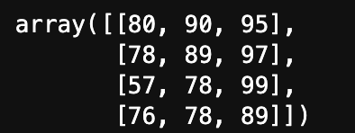

可以使用 type() 函数查看数据类型

```python
type(x)
```

运行结果：


### ndarray 相比 list 的优势

使用 `Python` 原生的列表也可以实现相同的效果，但是效率上是没有 `ndarray` 高的。

这是因为俩者内存的存储方式是不一样的，Python 原生的 list 是可以同时存储不同类型数据的，这就导致 list 的底层实现是通过存储地址实现的，相当于查找数据时先找到地址，再找到具体数据。而 ndarray 存储的元素类型是相同的，因此底层实现的时候可以使用数组实现，它的内存地址是连续的，因此在访问数据的时候更方便。

在数据科学中，需要处理的数据量一般都比较大，使用 ndarray 可以省掉很多循环，这样就占优势了。

### np.shape

- 解释：ndarray 的一个属性

- 作用：查看数组维度的元素

代码测试：(这里的接着使用上面的代码)

```python
x.shape
```

运行结果：

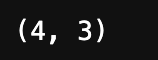

结果显示 (4, 3) ，表示数据是 4行3列。

### np.ndim

- 解释：ndarray 的一个属性

- 作用：查看数组的维度

代码测试：

```python
x.ndim
```

运行结果：


结果显示 2 ，表示这是一个二维数组。

### np.size

- 解释：ndarray 的一个属性

- 作用：查看数组中的元素数量

代码测试：

```python
x.size
```

运行结果：


结果显示 12 ，代表数组中包含了12个元素，对应前面的 `4行3列` ，`4x3`  可以计算出元素数量

### np.dtype

- 解释：ndarray 的一个属性
- 作用：查看数组元素的数据类型

代码测试：

```python
x.dtype
```

运行结果：

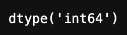

结果显示 int64 ，代表数组中元素是 int64 类型， int64 类型占用 8 个字节

### np.itemsize

解释：ndarray 的一个属性

作用：查看数组中一个元素所占的空间(字节)

代码测试：

```python
x.itemsize
```

运行结果：


### ndarray 数据类型

ndarray 数组可以使用不同的数据类型，比如上面的 `int64` ，常见的数据类型有以下这些：

| 类型名        | 解释                                                 |
| ------------- | ---------------------------------------------------- |
| np.int64      | 整数，取值范围在 -2^63 到 2^63-1                     |
| np.int32      | 整数，取值范围在 -2^31 到 2^31-1                     |
| np.int16      | 整数，取之范围在 -2^15 到 2^15-1 （-32768 到 32767） |
| np.int8       | 整数，取值范围在 -128 到 127                         |
| np.uint8      | 无符号整数，0 到 255                                 |
| np.uint16     | 无符号整数，0 到 2^16-1 （0到65535）                 |
| np.uint32     | 无符号整数，0 到 2^32-1                              |
| np.uint64     | 无符号整数，0 到 2^64-1                              |
| np.float16    | 半精度浮点数，16位                                   |
| np.float32    | 单精度浮点数，32位                                   |
| np.float64    | 双精度浮点数，64位                                   |
| np.bool       | 布尔类型，一个字节存储                               |
| np.complex64  | 复数                                                 |
| np.conplex128 | 复数                                                 |
| np.string_    | 字符串                                               |
| np.unicode_   | unicode类型                                          |
| np.object_    | python对象                                           |

### 指定类型创建数组

在使用 `np.array()` 方法创建 `ndarray` 数组时，使用 `dtype=数据类型` 就可以指定创建的数组元素类型了。

代码测试：

```python
import numpy as np

# 创建一个 Python 二维列表
x_list = [
    [80, 90, 95],
    [78, 89, 97],
    [57, 78, 99],
    [76, 78, 89]
]
# 使用 numpy 创建 ndarray 数组
x = np.array(x_list, dtype=np.float64)
x
```

运行结果：

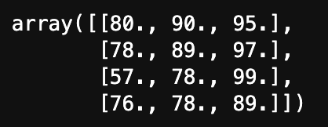

可以从运行结果中看到数组中的数字后面多了一个点，证明他们是浮点数。

代码测试：

```python
y = np.array(["qwer", "d", "f", "a"], dtype=np.string_)
y
```

运行结果：

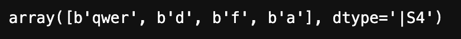

运行结果中有 `dtype='|S4'` 它是指在数组中有一个字符串是四个元素的。

**备注：**数据类型如果不指定则默认是 int64 和 float64 。

## 生成数组的方法

生成数组的方法有很多，这里列举一些比较常用的，详细可以参考 [>>官方文档](https://numpy.org/doc/stable/reference/routines.array-creation.html#)


### np.ones(shape, dtype)

- 作用：生成元素均为 1 的数组。

示例1：

```python
ones = np.ones([3, 4])
ones
```

运行结果：

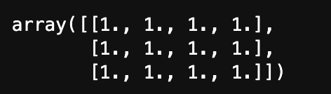

从运行结果可以看到：如果不设置 `dtype` ，默认是 `float64` 。

示例2:

```python
ones2 = np.ones([3, 4], dtype=np.int64)
ones2
```

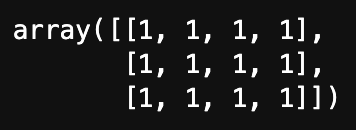

这里设置了 `dtype` ，可以看到生成的数组元素为 1 。

### np.zeros(shape, dtype)

- 作用：生成元素均为 0 的数组。

示例1：

```python
zeros = np.zeros([3, 4])
zeros
```

运行结果：

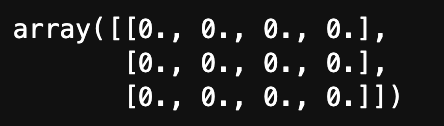

示例2：

```python
zeros2 = np.zeros([3, 4], dtype=np.int64)
zeros2
```

运行结果：

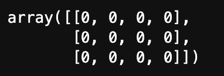

### np.asarray(array, dtype)

- 作用：从现有数组生成新的数组

`np.array()` 也可以使用现有数组生成新的数组。

示例1：

```python
# 使用 array() 创建一个数组 x
x = np.array([[1, 2, 3],[4, 5, 6]])
# array() 使用现有数组生成新的数组
x1 = np.array(x)
x1
```

运行结果：

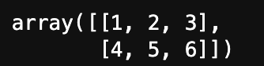

示例2：

```python
# 使用 asarray() 创建一个数组
x2 = np.asarray(x)
x2
```

运行结果：

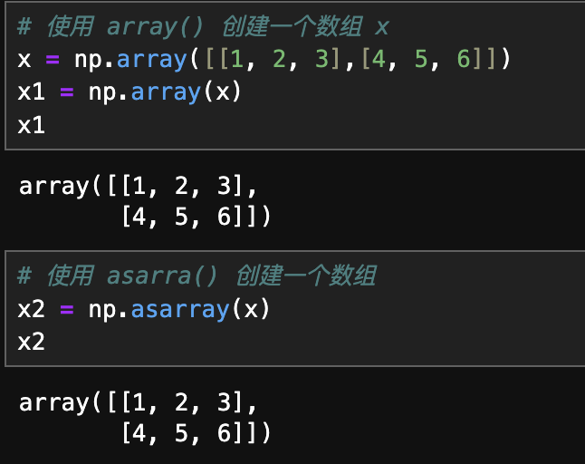

这俩个 numpy 的方法生成的数据看上去没有任何区别。

但实际上它们俩是有区别的，修改一下 x 中的某个数据再分别输出 x1 和 x2 查看结果：

```python
x[0, 0] = 10
x
```

运行结果：

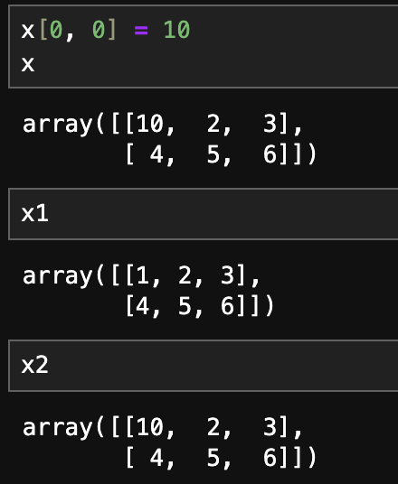

从结果看到，`x` 中的 `第0列0行` 的元素修改为 `10` 后，`x` 中的数据修改了，使用 `array()` 创建的 `x1` 中的数据没有变化，但是使用 `asarray()` 创建的 `x2` 中的数据跟着修改了。这说明 `array()` 利用原有数组创建新的数组时是深拷贝，而 `asarray()` 利用原有数组创建新的数组时是浅拷贝。

### np. linspace(start, stop, num, endpoint)

- 作用：创建等差数组，可以指定数量。
- start：序列的起始值
- stop：序列的终止值
- num：要生成的样本数量，默认为50
- endpoint：序列中是否包含 stop 值，默认为 true

示例：

```python
arr = np.linspace(0, 100, 21)
arr
```

运行结果：

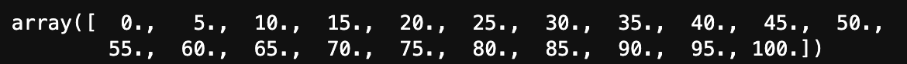

结果显示可以看到生成了 21 个数据，范围是 0 到 100 之间的等差数列。

 `dtype` 是 `float64`  ，它是根据 `strat` 和 `stop` 推断出来的，也可以在后面追加指定的 `dtype` 。

### np.arange(start, stop, step)

- 作用：创建等差数组，可以指定步长。
- strat：起始值
- stop：终止值
- step：步长

示例：

```python
arr = np.arange(0, 100, 5)
arr
```

运行结果：

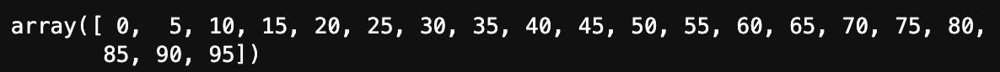

从结果可以看到，生成的数组中不包含 `stop` 值，步长为 5。

不指定 `dtype` 的情况下， 根据其他输入参数推断数据类型 。

### np.logspace(start, stop, num)

- 作用：创建等比数列。
- start：起始值
- stop：终止值
- num：要生成的样本数量，默认为 50

示例：

```python
arr = np.logspace(2, 3, 4, dtype=np.float64)
arr
```

运行结果：

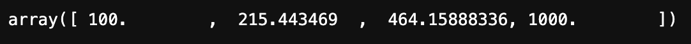

这里需要**注意**， `start` 和 `stop` 分别是 `10` 的次方数。 示例代码中实际上在 100 到 1000 之间生成一个等比数列。

更多生成数组的方法可以查看 [>>官方文档](https://numpy.org/doc/stable/reference/routines.array-creation.html)


## 统计学相关概念

### 方差

- 衡量一组数据的离散程度
- 公式：

$$
方差（σ^2） = \frac{(x1-μ)^2 + (x2-μ)^2 + (x3-μ)^2}{n}
$$

- x1：具体的数据
- μ：平均值
- n：数据的数量

### 标准差

方差开根号即标准差
$$
标准差（σ） = \sqrt{\frac{1}{n}\sum_{i=1}^{n}{(x_i-μ)^2}}
$$
标准差越小，数据分布越紧凑，标准差越大，数据分布越分散


### 正态分布

正态分布是一种连续概率分布。

它有两个参数决定，第一个参数是均值(上面公式中的 μ)，第二个参数是标准差(σ)，正态分布一般记做 𝒩(μ, σ)。

μ 决定了正态分布图形的位置，标准差 σ 决定定了分布的幅度，μ = 0，σ = 1 时称为标准正态分布。


## 生成正态分布数据

### np.random.randn(d0, d1, ... , dn)

- 作用：从标准正态分布中返回一个或多个样本值


### np.random.standard_normal(size=None)

- 作用：返回指定形状的标准正态分布的数组


### np.random.normal(loc=0.0, scale=1.0, size=None)

- loc：概率分布的均值，（上图中的 μ ）， (概率分布的中心)
- scale：概率分布的标准差，（上图中的 σ ）（概率分布的宽度，越大越矮胖）
- size：输出的 shape， 默认为 None

使用第三种方式可以实现上面两种，因此学会第三种方式的操作即可，前面两种有印象即可。

示例：

```python
import numpy as np
import matplotlib.pyplot as plt

# 生成数据
x = np.random.normal(0, 1, 1000000)

# 创建画布
plt.figure(figsize=(20, 10), dpi=72)

# 绘制直方图
plt.hist(x, 1000)  # 1000 代表分多少组

# 显示图像
plt.show()
```


