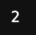
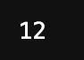

# Numpy

## <span style="color:#21897e">Numpy 介绍</span>

`Numpy`  是一个开源的科学计算库，用于处理多维数组。其可以处理常见的数组和矩阵。其最大的优势是比 `Python` 原生处理这些数据的速度更快。

## <span style="color:#21897e">安装 Numpy</span>

```python
pip install numpy
```

安装完成之后可以在 `ipython` 或 `普通shell解释器` 使用下面代码进行测试：

```python
import numpy as np
n.__version__
```

普通 python shell 环境

```python
import numpy as np
print(np.__version__)
```

## <span style="color:#21897e">ndarray 数据结构</span>

### <span style="color:#3ba99c">ndarray 是什么</span>

`Numpy` 主要使用 `ndarray` 对象处理多维数组，可以理解为 `Numpy` 的一种数据容器，是 **n 维数组类型** ，是**相同类型**的数据集合。

比如学生成绩：

| 语文 | 数学 | 英语 |
| ---- | ---- | ---- |
| 80   | 90   | 95   |
| 78   | 89   | 97   |
| 57   | 78   | 99   |
| 76   | 78   | 89   |

这个数据可以使用 `ndarray` 类型来存储，它是二维的，其次它的数据都是整数类型，使用 `Python` 原生的数据来行来描述的话则是二维列表。

### <span style="color:#3ba99c">np.array()</span>

`array()` 函数可以接受任意序列型对象，生成一个新的 `Numpy` 数组（ ndarray 对象，有时候也称 ndarray 数组）。

### <span style="color:#3ba99c">生成数据测试</span>

在 `jupyter notebook` 或者 `jupyter lab` 环境中：

```python
import numpy as np

# 创建一个 Python 二维列表
x_list = [
    [80, 90, 95],
    [78, 89, 97],
    [57, 78, 99],
    [76, 78, 89]
]

# 使用 numpy 创建 ndarray 数组
x = np.array(x_list)
x
```

运行结果：


可以使用 type() 函数查看数据类型

```python
type(x)
```

运行结果：


### <span style="color:#3ba99c">ndarray 相比 list 的优势</span>

使用 `Python` 原生的列表也可以实现相同的效果，但是效率上是没有 `ndarray` 高的。

这是因为俩者内存的存储方式是不一样的，Python 原生的 list 是可以同时存储不同类型数据的，这就导致 list 的底层实现是通过存储地址实现的，相当于查找数据时先找到地址，再找到具体数据。而 ndarray 存储的元素类型是相同的，因此底层实现的时候可以使用数组实现，它的内存地址是连续的，因此在访问数据的时候更方便。

在数据科学中，需要处理的数据量一般都比较大，使用 ndarray 可以省掉很多循环，这样就占优势了。

### <span style="color:#3ba99c">np.shape</span>

- 解释：ndarray 的一个属性

- 作用：查看数组维度的元素

代码测试：(这里接上面的代码)

```python
x.shape
```

运行结果：


结果显示 (4, 3) ，表示数据是 4行3列。

### <span style="color:#3ba99c">np.ndim</span>

- 解释：ndarray 的一个属性

- 作用：查看数组的维度

代码测试：

```python
x.ndim
```

运行结果：



结果显示 2 ，表示这是一个二维数组。

### <span style="color:#3ba99c">np.size</span>

- 解释：ndarray 的一个属性

- 作用：查看数组中的元素数量

代码测试：

```python
x.size
```

运行结果：



结果显示 12 ，代表数组中包含了12个元素，对应前面的 `4行3列` ，`4x3`  可以计算出元素数量

### <span style="color:#3ba99c">np.dtype</span>

- 解释：ndarray 的一个属性
- 作用：查看数组元素的数据类型

代码测试：

```python
x.dtype
```

运行结果：


结果显示 int64 ，代表数组中元素是 int64 类型， int64 类型占用 8 个字节

### <span style="color:#3ba99c">np.itemsize</span>

解释：ndarray 的一个属性

作用：查看数组中一个元素所占的空间(字节)

代码测试：

```python
x.itemsize
```

运行结果：


### <span style="color:#3ba99c">ndarray 数据类型</span>

ndarray 数组可以使用不同的数据类型，比如上面的 `int64` ，常见的数据类型有以下这些：

| 类型名        | 解释                                                 |
| ------------- | ---------------------------------------------------- |
| np.int64      | 整数，取值范围在 -2^63 到 2^63-1                     |
| np.int32      | 整数，取值范围在 -2^31 到 2^31-1                     |
| np.int16      | 整数，取之范围在 -2^15 到 2^15-1 （-32768 到 32767） |
| np.int8       | 整数，取值范围在 -128 到 127                         |
| np.uint8      | 无符号整数，0 到 255                                 |
| np.uint16     | 无符号整数，0 到 2^16-1 （0到65535）                 |
| np.uint32     | 无符号整数，0 到 2^32-1                              |
| np.uint64     | 无符号整数，0 到 2^64-1                              |
| np.float16    | 半精度浮点数，16位                                   |
| np.float32    | 单精度浮点数，32位                                   |
| np.float64    | 双精度浮点数，64位                                   |
| np.bool       | 布尔类型，一个字节存储                               |
| np.complex64  | 复数                                                 |
| np.conplex128 | 复数                                                 |
| np.string_    | 字符串                                               |
| np.unicode_   | unicode类型                                          |
| np.object_    | python对象                                           |

### <span style="color:#3ba99c">指定类型创建数组</span>

在使用 `np.array()` 方法创建 `ndarray` 数组时，使用 `dtype=数据类型` 就可以指定创建的数组元素类型了。

代码测试：

```python
import numpy as np

# 创建一个 Python 二维列表
x_list = [
    [80, 90, 95],
    [78, 89, 97],
    [57, 78, 99],
    [76, 78, 89]
]
# 使用 numpy 创建 ndarray 数组
x = np.array(x_list, dtype=np.float64)
x
```

运行结果：


可以从运行结果中看到数组中的数字后面多了一个点，证明他们是浮点数。

代码测试：

```python
y = np.array(["qwer", "d", "f", "a"], dtype=np.string_)
y
```

运行结果：


运行结果中有 `dtype='|S4'` 它是指在数组中有一个字符串是四个元素的。

**备注：**数据类型如果不指定则默认是 int64 和 float64 。

## <span style="color:#21897e">生成数组的方法</span>

生成数组的方法有很多，这里列举一些比较常用的，详细可以参考 [>>官方文档](https://numpy.org/doc/stable/reference/routines.array-creation.html#)


### <span style="color:#3ba99c">np.ones(shape, dtype)</span>

- 作用：生成元素均为 1 的数组。

示例1：

```python
ones = np.ones([3, 4])
ones
```

运行结果：


从运行结果可以看到：如果不设置 `dtype` ，默认是 `float64` 。

示例2:

```python
ones2 = np.ones([3, 4], dtype=np.int64)
ones2
```


这里设置了 `dtype` ，可以看到生成的数组元素为 1 。

### <span style="color:#3ba99c">np.zeros(shape, dtype)</span>

- 作用：生成元素均为 0 的数组。

示例1：

```python
zeros = np.zeros([3, 4])
zeros
```

运行结果：


示例2：

```python
zeros2 = np.zeros([3, 4], dtype=np.int64)
zeros2
```

运行结果：


### <span style="color:#3ba99c">np.asarray(array, dtype)</span>

- 作用：从现有数组生成新的数组

`np.array()` 也可以使用现有数组生成新的数组。

示例1：

```python
# 使用 array() 创建一个数组 x
x = np.array([[1, 2, 3],[4, 5, 6]])
# array() 使用现有数组生成新的数组
x1 = np.array(x)
x1
```

运行结果：


示例2：

```python
# 使用 asarray() 创建一个数组
x2 = np.asarray(x)
x2
```

运行结果：


这俩个 numpy 的方法生成的数据看上去没有任何区别。

但实际上它们俩是有区别的，修改一下 x 中的某个数据再分别输出 x1 和 x2 查看结果：

```python
x[0, 0] = 10
x
```

运行结果：


从结果看到，`x` 中的 `第0列0行` 的元素修改为 `10` 后，`x` 中的数据修改了，使用 `array()` 创建的 `x1` 中的数据没有变化，但是使用 `asarray()` 创建的 `x2` 中的数据跟着修改了。这说明 `array()` 利用原有数组创建新的数组时是深拷贝，而 `asarray()` 利用原有数组创建新的数组时是浅拷贝。

### <span style="color:#3ba99c">np. linspace(start, stop, num, endpoint)</span>

- 作用：创建等差数组，可以指定数量。
- start：序列的起始值
- stop：序列的终止值
- num：要生成的样本数量，默认为50
- endpoint：序列中是否包含 stop 值，默认为 true

示例：

```python
arr = np.linspace(0, 100, 21)
arr
```

运行结果：


结果显示可以看到生成了 21 个数据，范围是 0 到 100 之间的等差数列。

 `dtype` 是 `float64`  ，它是根据 `strat` 和 `stop` 推断出来的，也可以在后面追加指定的 `dtype` 。

### <span style="color:#3ba99c">np.arange(start, stop, step)</span>

- 作用：创建等差数组，可以指定步长。
- strat：起始值
- stop：终止值
- step：步长

示例：

```python
arr = np.arange(0, 100, 5)
arr
```

运行结果：


从结果可以看到，生成的数组中不包含 `stop` 值，步长为 5。

不指定 `dtype` 的情况下， 根据其他输入参数推断数据类型 。

### <span style="color:#3ba99c">np.logspace(start, stop, num)</span>

- 作用：创建等比数列。
- start：起始值
- stop：终止值
- num：要生成的样本数量，默认为 50

示例：

```python
arr = np.logspace(2, 3, 4, dtype=np.float64)
arr
```

运行结果：


这里需要**注意**， `start` 和 `stop` 分别是 `10` 的次方数。 示例代码中实际上在 100 到 1000 之间生成一个等比数列。

更多生成数组的方法可以查看 [>>官方文档](https://numpy.org/doc/stable/reference/routines.array-creation.html)


## <span style="color:#21897e">统计学相关概念</span>

### <span style="color:#3ba99c">方差</span>

- 衡量一组数据的离散程度
- 公式：

$$
\text{方差}(σ^2) = \frac{(x1-μ)^2 + (x2-μ)^2 + (x3-μ)^2}{n}
$$

- x1：具体的数据
- μ：平均值
- n：数据的数量

### <span style="color:#3ba99c">标准差</span>

方差开根号即标准差
$$
\text{标准差}(σ) = \sqrt{\frac{1}{n}\sum_{i=1}^{n}{(x_i-μ)^2}}
$$
标准差越小，数据分布越紧凑，标准差越大，数据分布越分散


### <span style="color:#3ba99c">正态分布</span>

正态分布是一种连续概率分布。

它有两个参数决定，第一个参数是均值(上面公式中的 μ)，第二个参数是标准差(σ)，正态分布一般记做 𝒩(μ, σ)。

μ 决定了正态分布图形的位置，标准差 σ 决定定了分布的幅度，μ = 0，σ = 1 时称为标准正态分布。


::: tip 小提示：

这里的图片在 `黑暗` 模式下看不清，可以点击右上角图标调整一下。

:::

## <span style="color:#21897e">生成正态分布数据</span>

### <span style="color:#3ba99c">np.random.randn(d0, d1, ... , dn)</span>

- 作用：从标准正态分布中返回一个或多个样本值


### <span style="color:#3ba99c">np.random.standard_normal(size=None)</span>

- 作用：返回指定形状的标准正态分布的数组


### <span style="color:#3ba99c">np.random.normal(loc=0.0, scale=1.0, size=None)</span>

- loc：概率分布的均值，（上图中的 μ ）， (概率分布的中心)
- scale：概率分布的标准差，（上图中的 σ ）（概率分布的宽度，越大越矮胖）
- size：输出的 shape， 默认为 None

使用第三种方式可以实现上面两种，因此学会第三种方式的操作即可，前面两种有印象即可。

示例：

```python
x = np.random.normal(0, 1, (3, 4))
x
```

运行结果：


生成三行四列的正态分布的随机数据。

## 生成均匀分布数据

### np.random.rand(d0, d1, ... , dn)

- 作用：返回 [0.0, 1.0) 内的一组均匀分布的数据。

### <span style="color:#3ba99c">np.random.uniform(low=0.0, high=1.0, size=None)</span>

- 作用：从一个均匀分布的数据集 [low, high) 中随机采样。返回 ndarray 类型。
- low：采样下界，默认值为 0 。
- high：采样上界，默认值为 1 。
- size：输出样本数量，为 int 或者 tuple 类型。输出的 shape 由此设定。

### np.random.randint(low, high=None, size=None)

- 作用：从一个均匀分布的数据集中采样生成数组。
- 取值范围：high 不为 None 时，取 [low, high) 之间的随机数，否则取 [0, low) 之间的随机数。

示例：

```python
x = np.random.uniform(0, 1, (3, 4))
x
```

运行结果：


## 数组操作

### 索引访问

::: tip 索引&索引访问

数组的索引和 Python 中的索引一样，都是从 **`0`** 开始的。可以通过索引对数组进行访问和切片操作。

二维数组因为有两个维度，所以无论是索引访问还是切片也都有两个维度，其他维度的数组同理。

注意：切片时，包含 `:` 前面的索引，不包含  `:` 后面的索引

:::

示例：

```python
# 生成一个 ndarray 类型 3行4列 的二维数组
x = np.random.normal(0, 1, (3, 4))
# 查看数据
print(x)
print("---------------------------")
# 访问 第3行 第4列 的数据
print(x[2, 3])  # 注意索引从 0 开始，3行4列对应的索引是 2和 3
print("---------------------------")
# 访问 第2行 第2 到 第3列的数据  
print(x[2, 1:3]) # 注意切片包含 : 前面的索引 不包含 : 后面的索引
```

运行结果：


### ndarray.reshape(shape, order)

- 作用：返回相同数据、形状不同的视图
- 注意：行、列不进行互换

示例：

```python
# 生成一个随机的 3行4列的数据
x = np.random.normal(0, 1, (3, 4))
# 输出数据查看
print(x)
print("---------------------------")
# 修改形状
y = x.reshape([2, 6])
print(y)
```

运行结果：


::: tip 注意

注意修改 ndarray 的形状时，要保持数据量一致。

:::

### ndarray.resize(new_shape)

- 作用：修改数组本身的形状
- 注意：行、列不进行互换

示例：

```python
x.resize([2, 6])
x
```

运行结果：


::: tip reshape 和 resize 的区别

reshape 是返回一个新的数据 ( y )，不会修改原本数据 ( x )。

resize 会修改原本的数据 (x) 。

:::

### ndarray.T

- 作用：数组转制， 将数组的行和列互换。
- 返回数组，不修改原数组。

示例：

```python
# 生成一个随机的 3行4列的数据
x = np.random.normal(0, 1, (3, 4))
# 输出数据查看
print(x)
print("---------------------------")
# 将数组的行和列互换
y = x.T
y
```

运行结果：


::: details 提示

这里由于代码是在 jupyter 环境下写的，因此最后一行只写了 y 也是可以打印的，

而上面写 `print(x)` ，是因为不写则 `jupyter` 只会打印最后的 y ，

这样可以看到原本的数组和修改之后的数组，方便观察。

:::

### ndarray.astype()

- 作用：修改数组类型，返回新的数组

示例：

```python
# 创建 int32 类型数组
x = np.array([[1, 2, 3], [4, 5, 6]], dtype=np.int32)
# 输出数据查看
print(x, x.dtype)
print("---------------------------")
# 将数组的类型换成 int64
y = x.astype(np.int64)
print(y, y.dtype)
```

运行结果：


## 数组运算

### 比较运算

数组可以针对数组中的元素进行判断并修改值

示例：

```python
# 生成一组平均分布的学生成绩，5个学生，3个学科
arr = np.random.uniform(40, 100, (5, 3))
# 显示原数据
print(arr)
# 成绩大于60,显示为 true
print(arr>60)
# 成绩小于60的全部改为60
arr[arr<60] = 60
arr
```

运行结果：


### np.all()

- 作用：判断被查询的数据是否全部满足条件。
- 成立判断成立则返回 true，否则返回 false 。

示例：

```python
# 生成一组平均分布的学生成绩，5个学生，3个学科
score = np.random.uniform(40, 100, (5, 3))
# 显示原数据
print(score)
# 判断查询的数据是否全部大于 60
np.all(score>60)
```

运行结果：


::: details 它和直接使用数据判断的区别

直接判断则是会判断每一个数据，成立输出为 true, 不成立输出为 false。

```python
# 生成一组平均分布的学生成绩，5个学生，3个学科
score = np.random.uniform(40, 100, (5, 3))
# 显示原数据
print(score)
print("------------------------------------")
# 判断查询的数据是否全部大于 60
res = np.all(score>60)
print(res)
print("------------------------------------")
score > 60
```

运行结果：


:::

### np.any()

- 作用：判断被查询的数据是否有满足条件的。
- 满足返回 true, 不满足返回 false。

示例：

```python
# 生成一组平均分布的学生成绩，5个学生，3个学科
score = np.random.uniform(40, 100, (5, 3))
# 显示原数据
print(score)
print("------------------------------------")
# 判断查询的数据是否有大于 60 的
res = np.any(score[4, 0:3]>60)  # 这里切片了最后一行的数据进行判断
print(res)
```

运行结果：


::: tip 注意 all() 和 any() 的区别

all() 是查询的数据都要满足条件。

any() 则是查询的数据只要有满足条件的即返回 true 。

:::

### np.where()

- 作用：三元运算

示例：

```python
# 生成一组平均分布的学生成绩，5个学生，3个学科
score = np.random.uniform(40, 100, (5, 3))
# 显示原数据
print(score)
print("------------------------------------")
# 判断查询的数据是否有大于 60 的，大于60的，修改为 1,否则修改为 0
np.where(score>60, 1, 0)
```

运行结果：


### np.logical_and()

- 作用：做逻辑运算，and

示例：

```python
# 生成一组平均分布的学生成绩，5个学生，3个学科
score = np.random.uniform(40, 100, (5, 3))
# 显示原数据
print(score)
print("------------------------------------")
# 判断查询的数据在 60-80之间的, 满足修改为 1,否则修改为 0
np.where(np.logical_and(score>60, score<80), 1, 0)
```

运行结果：


### np.logical_or()

- 作用：逻辑运算 or

### np.min(a, axis)

- 作用：返回数组的最小值，或沿轴的最小值。

### np.max(a, axis)

- 作用：返回数组的最大值，或沿轴的最大值。

### np.median(a, axis)

- 作用：沿指定轴计算中值

### np.mean(a, axis, dtype)

- 作用：沿指定轴计算平均值

### np.std(a, axis, dtype)

- 作用：沿指定轴计算标准差

### np.var(a, axis, dtype)

- 作用：沿指定轴计算方差

示例：

```python
# 生成一组员工薪资数据
salary = np.random.randint(6000, 50000, (5, 5))
# 打印查看
print(salary)
print("---------------------------------------")

# 查看最小值
s_min = np.min(salary)
print(s_min)
print("---------------------------------------")

# 查看最大值
s_max = np.max(salary)
print(s_max)
print("---------------------------------------")

# 按列查看中值
s_median = np.median(salary, axis=0)
print(s_median)
print("---------------------------------------")

# 按行查看平均值
s_mean = np.mean(salary, axis=1)
print(s_mean)
print("---------------------------------------")

# 按行计算标准差
s_std = np.std(salary, axis=1)
print(s_std)
print("---------------------------------------")

# 按行计算方差
s_var = np.var(salary, axis=1)
print(s_var)
```


## 数组间运算

### 算数运算

示例：

```python
# 创建一个数组
arr = np.array([[1,2,3], [4, 5, 6]])
arr1 = arr + 1
print(arr1)
arr2 = arr / 2
print(arr2)
```

运行结果：


### 数组之间运算

- 数组和数组进行运算

示例：

```python
arr1 = np.array([[1, 2, 3], [4, 5, 6]])
arr2 = np.array([[2, 3, 4], [5, 6, 7]])
arr1 + arr2
```

运行结果：


计算规则：


::: tip 广播机制

数组在进行矢量运算时，要求数组形状相等。

当形状不相等时，广播机制就发挥作用了，它可以扩展数组，使得数组的 shape 属性相同。

以此来进行矢量运算。

:::

示例：

```python
arr1 = np.array([[1], [2], [3]])
arr2 = np.array([4, 5])
arr1 + arr2
```

运行结果：


扩展图示：


## 矩阵和向量

### 矩阵

::: tip 注意

矩阵必须是二维的（array不一定，可以任意维）。

:::

示例：
$$
\begin{matrix}
2 & 3 & 4 \\
5 & 6 & 7 \\
\end{matrix}
$$
这是一个 `2x3` 的矩阵，即 `2行3列` ，矩阵的维数即 `行数x列数` 。

::: info 其他表示

矩阵的表示方法大体上是这样的，很多地方也会使用括号之类的包裹起来，比如下面这些

::: tabs

@tab 小括号
$$
\begin{pmatrix}
2 & 3 & 4 \\
5 & 6 & 7 \\
\end{pmatrix}
$$
@tab:active 中括号
$$
\begin{bmatrix}
2 & 3 & 4 \\
5 & 6 & 7 \\
\end{bmatrix}
$$
@tab 大括号
$$
\begin{Bmatrix}
2 & 3 & 4 \\
5 & 6 & 7 \\
\end{Bmatrix}
$$
:::

### 向量

向量是一种特殊的矩阵，一般列向量巨多

示例：
$$
\begin{bmatrix}
& 1 &\\
& 2 &\\
& 3 &\\
\end{bmatrix}
$$

### 矩阵加法

行和列数量相等时可以相加。

示例：
$$
\begin{bmatrix}
& 1 & 2 & 3 & \\
& 4 & 4 & 6 & \\
\end{bmatrix}
+
\begin{bmatrix}
& 1 & 2 & 3 & \\
& 4 & 4 & 6 & \\
\end{bmatrix}
=
\begin{bmatrix}
& 2 & 4 & 6 & \\
& 8 & 8 & 12 & \\
\end{bmatrix}
$$

### 矩阵和标量乘法

矩阵和标量相乘

示例：
$$
3 *
\begin{bmatrix}
& 1 & 2 & 3 & \\
& 4 & 4 & 6 & \\
\end{bmatrix}
=
\begin{bmatrix}
& 3 & 6 & 9 & \\
& 12 & 12 & 18 & \\
\end{bmatrix}
$$
::: tip 

每一个都要相乘

:::


<CommentService />


