# Pandas

## <FontIcon icon="home" size="20" />简介

Pandas是一个以 Numpy 为基础开源的 Python 库。

### 为什么使用 Pandas ?

- 增强图表可读性

:::tabs

@tab Numpy 图表

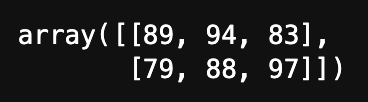

@tab Pandas 图表

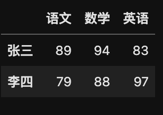

:::

- 数据处理能力更快捷
- 读取文件方便
- 封装了 Numpy

## 安装

使用 pip 安装即可

```python
pip install pandas
```


## 数据结构

### Series

类似一维数组的数据结构，数据和索引组成。

### 创建 Series

1. 导入 pandas 

```python
import pandas as pd
```

2. 创建 Series

```python
pd.Series(data=None, index=None, dtype=None)
```

:::info 参数说明

- data：传入的数据，可以是 ndarray / list 等。
- index：索引，必须唯一，和数据长度一致，不传则自动默认创建 0～n 的整数索引。
- dtype：数据的类型。

:::

:::details 示例：

:::tabs

@tab:active 不传index参数

```python
import pandas as pd
import numpy as np

# 生成一组数据
x = np.random.randint(100, 1000, 10)
print(x)
print("-----------------------------------------")

# 创建 Series 数据
y = pd.Series(x)
y
```

运行结果：

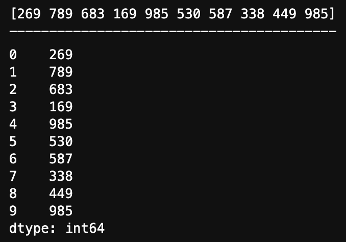

@tab 传index参数

```python
import pandas as pd
import numpy as np

# 生成一组数据
x = np.random.randint(100, 1000, 10)
print(x)
print("-----------------------------------------")

# 创建 Series 数据
y = pd.Series(x, [10, 11, 12, 13, 14, 15, 16, 17, 18, 19])
y
```

运行结果：

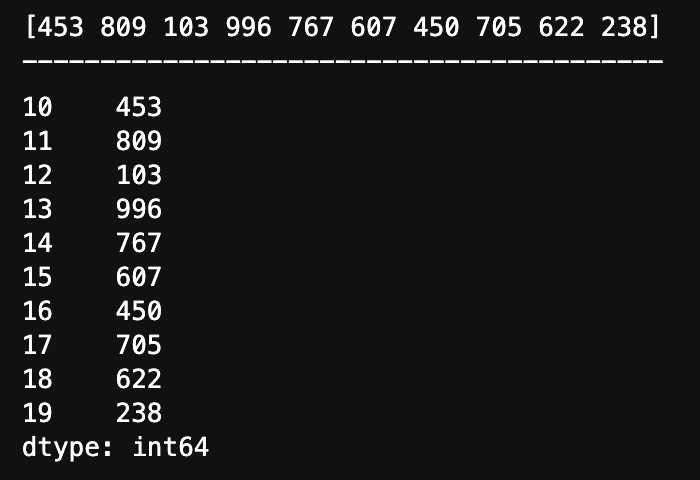

@tab 传 dtype

```python
import pandas as pd
import numpy as np

# 生成一组数据
x = np.random.randint(100, 1000, 10)
print(x)
print("-----------------------------------------")

# 创建 Series 数据
y = pd.Series(x, [10, 11, 12, 13, 14, 15, 16, 17, 18, 19], dtype=np.float64)
y
```

运行结果：


@tab 通过字典创建

```python
score = pd.Series({"语文": 96, "数学":100, "英语":88})
score
```

运行结果：

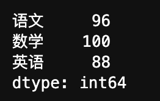

:::

### Series 属性

Series 对象有两个属性，分别是 index 和 values。

:::details 示例

:::tabs

@tab index

```python
import pandas as pd

# 利用字典创建数据
score = pd.Series({"语文": 96, "数学":100, "英语":88})

# 输出 score 数据查看
print(score)
print("------------------------------------")

# 输出 index 数据
print(score.index)
```

运行结果：

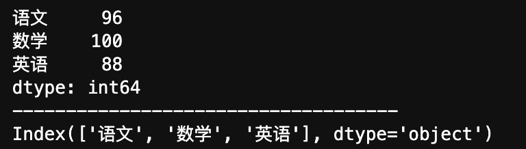

@tab values

```python
import pandas as pd

# 利用字典创建数据
score = pd.Series({"语文": 96, "数学":100, "英语":88})

# 输出 score 数据查看
print(score)
print("------------------------------------")

# 输出 values 数据
print(score.values)
```

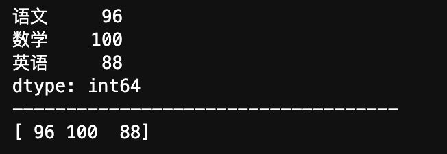

@tab 通过 index 获取数据

```python
import pandas as pd

# 利用字典创建数据
score = pd.Series({"语文": 96, "数学":100, "英语":88})

# 输出 score 数据查看
print(score)
print("------------------------------------")

# 直接通过索引获取 value
print(score["语文"])
```

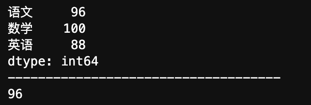

:::


### DataFrame

类似二维数组或表格的对象，有行索引和列索引

- 行索引： `index`  `0轴` `axis=0` ，表明不同的行，横向索引。
- 列索引：`columnns` `1轴` `axis=1` ，表明不同的列，纵向索引。

:::tip

由于 `DataFrame` 名字比较长，后续文章中称其为 `DF` 。

:::

### 创建 DataFrame

1. 导入 `pandas` 

```python
import pandas as pd
```

2. 创建 `DataFrame` 

```python
pd.DataFrame(data=None, index=None, columns=None)
```

:::info 参数说明

- data：数据
- index：行标签，不传则默认创建 `0～n` 的整数索引。
- columns：列标签，不传则默认创建 `0～n` 的整数索引。

:::


:::details 示例：

:::tabs

@tab 不传 index 和 columns

```python
import pandas as pd

# 构建数据
data_x = [[101, 102, 103],[209, 208, 207]]

# 创建 DataFrame
pd.DataFrame(data_x)
```

运行结果：


@tab 传 index 不传 columns

```python
import pandas as pd

# 构建数据
data_x = [[89, 94, 83],[79, 88, 97]]
data_index = ["张三", "李四"]

# 创建 DataFrame
pd.DataFrame(data_x, data_index)
```

运行结果：


@tab 传 index & 传 columns

```python
import pandas as pd

# 构建数据
data_x = [[89, 94, 83],[79, 88, 97]]
data_index = ["张三", "李四"]
data_col = ["语文", "数学", "英语"]

# 创建 DataFrame
pd.DataFrame(data_x, data_index, data_col)
```

运行结果：


:::

### DataFrame 属性

`DataFrame` 对象的属性比较多，主要有以下这些

- shape： `DataFrame` 的形状
- index：行索引列表
- columns：列索引列表
- values：内容数据的值
- T：转置（`DataFrame` 是类似二维数组的数据，可以行和列转置）
- head(5)：显示前5行的内容，默认值为5，可修改参数值
- tail(5)：显示后5行的内容，默认值为5，可修改参数值

:::details 示例：

:::tabs

@tab shape

```python
import pandas as pd

# 构建数据
data_x = [[89, 94, 83], [79, 88, 97], [99, 98, 78], [78, 89, 90], [67, 68, 99], [89, 94, 85]]
data_index = ["学生1", "学生2", "学生3", "学生4", "学生5", "学生6"]
data_col = ["语文", "数学", "英语"]

# 创建 DataFrame
my_data = pd.DataFrame(data_x, data_index, data_col)

# 查看 shape
my_data.shape
```

运行结果：

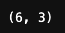

@tab index

```python
import pandas as pd

# 构建数据
data_x = [[89, 94, 83], [79, 88, 97], [99, 98, 78], [78, 89, 90], [67, 68, 99], [89, 94, 85]]
data_index = ["学生1", "学生2", "学生3", "学生4", "学生5", "学生6"]
data_col = ["语文", "数学", "英语"]

# 创建 DataFrame
my_data = pd.DataFrame(data_x, data_index, data_col)

# 查看 index
my_data.index
```

运行结果：

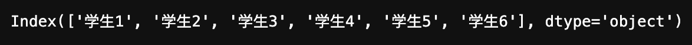

@tab columns

```python
import pandas as pd

# 构建数据
data_x = [[89, 94, 83], [79, 88, 97], [99, 98, 78], [78, 89, 90], [67, 68, 99], [89, 94, 85]]
data_index = ["学生1", "学生2", "学生3", "学生4", "学生5", "学生6"]
data_col = ["语文", "数学", "英语"]

# 创建 DataFrame
my_data = pd.DataFrame(data_x, data_index, data_col)

# 查看 columns
my_data.columns
```

运行结果：

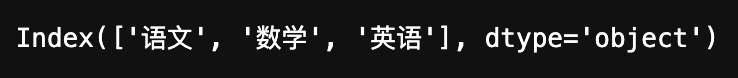

@tab values

```python
import pandas as pd

# 构建数据
data_x = [[89, 94, 83], [79, 88, 97], [99, 98, 78], [78, 89, 90], [67, 68, 99], [89, 94, 85]]
data_index = ["学生1", "学生2", "学生3", "学生4", "学生5", "学生6"]
data_col = ["语文", "数学", "英语"]

# 创建 DataFrame
my_data = pd.DataFrame(data_x, data_index, data_col)

# 查看 values
my_data.values
```

运行结果：

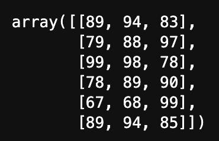

@tab T

```python
import pandas as pd

# 构建数据
data_x = [[89, 94, 83], [79, 88, 97], [99, 98, 78], [78, 89, 90], [67, 68, 99], [89, 94, 85]]
data_index = ["学生1", "学生2", "学生3", "学生4", "学生5", "学生6"]
data_col = ["语文", "数学", "英语"]

# 创建 DataFrame
my_data = pd.DataFrame(data_x, data_index, data_col)

# 查看 T 转置
my_data.T
```

运行结果：

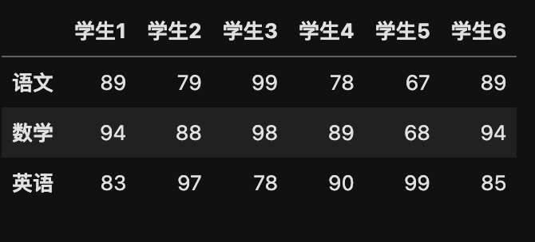

@tab head

```python
import pandas as pd

# 构建数据
data_x = [[89, 94, 83], [79, 88, 97], [99, 98, 78], [78, 89, 90], [67, 68, 99], [89, 94, 85]]
data_index = ["学生1", "学生2", "学生3", "学生4", "学生5", "学生6"]
data_col = ["语文", "数学", "英语"]

# 创建 DataFrame
my_data = pd.DataFrame(data_x, data_index, data_col)

# 查看 head
my_data.head() # 不写默认参数是 5
```

运行结果：

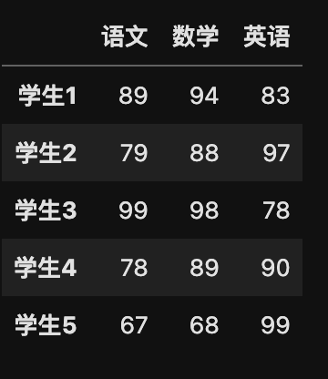

@tab tail

```python
import pandas as pd

# 构建数据
data_x = [[89, 94, 83], [79, 88, 97], [99, 98, 78], [78, 89, 90], [67, 68, 99], [89, 94, 85]]
data_index = ["学生1", "学生2", "学生3", "学生4", "学生5", "学生6"]
data_col = ["语文", "数学", "英语"]

# 创建 DataFrame
my_data = pd.DataFrame(data_x, data_index, data_col)

# 查看 tail
my_data.tail() # 不写则默认参数为 5
```

运行结果：

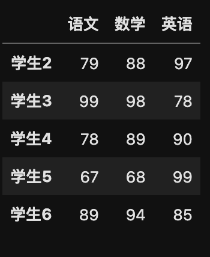

:::

### 设置某列为索引

#### set_index(keys, drop=True)

- keys：列标签或数组列表，需要设置为索引的列
- drop：默认为 `True` ，删除原来的列

:::details 示例：

:::tabs

@tab 设置某列为索引

```python
import pandas as pd

# 构建数据
data_x = [[89, 94, 83], [79, 88, 97], [99, 98, 78], [78, 89, 90], [67, 68, 99], [89, 94, 85]]
data_index = ["学生1", "学生2", "学生3", "学生4", "学生5", "学生6"]
data_col = ["语文", "数学", "英语"]

# 创建 DataFrame
my_data = pd.DataFrame(data_x, data_index, data_col)

# 设置 某列 为新的索引
my_data.set_index('语文', drop=True)
```

运行结果：

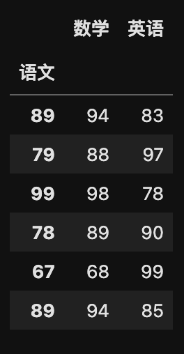

@tab 原数据(作对比)

```python
import pandas as pd

# 构建数据
data_x = [[89, 94, 83], [79, 88, 97], [99, 98, 78], [78, 89, 90], [67, 68, 99], [89, 94, 85]]
data_index = ["学生1", "学生2", "学生3", "学生4", "学生5", "学生6"]
data_col = ["语文", "数学", "英语"]

# 创建 DataFrame
my_data = pd.DataFrame(data_x, data_index, data_col)
my_data
```

运行结果：

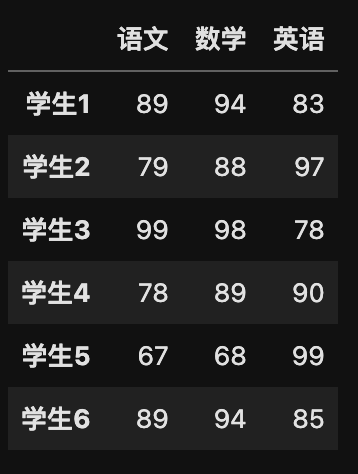

:::

:::tip

它还有其他参数，比如 `inplace` ，输入布尔值，表示当前操作是否对原数据生效，默认是 `False` 。

`inplace=False` 。

其他的一些参数基本不常用，如果需要查询则可以翻看源代码函数查看。

:::

### 重设DF索引

#### reset_index(drop = False)

- 作用：设置新的索引
- drop：默认为 `False` ,表示不删除原索引，设为 `True` 后，则删除原索引

:::tip

它还有其他的参数，但基本不常用，最经常使用的是 `drop` 。

:::

:::details 示例：

:::tabs

@tab drop=False

```python
import pandas as pd

# 构建数据
data_x = [[89, 94, 83], [79, 88, 97], [99, 98, 78], [78, 89, 90], [67, 68, 99], [89, 94, 85]]
data_index = ["学生1", "学生2", "学生3", "学生4", "学生5", "学生6"]
data_col = ["语文", "数学", "英语"]

# 创建 DataFrame
my_data = pd.DataFrame(data_x, data_index, data_col)

# 重设 DF 索引
my_data.reset_index(drop=False)
```

运行结果：

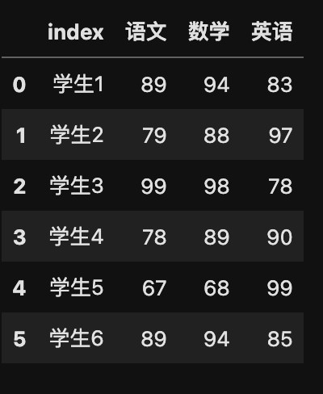

@tab drop=True

```python
import pandas as pd

# 构建数据
data_x = [[89, 94, 83], [79, 88, 97], [99, 98, 78], [78, 89, 90], [67, 68, 99], [89, 94, 85]]
data_index = ["学生1", "学生2", "学生3", "学生4", "学生5", "学生6"]
data_col = ["语文", "数学", "英语"]

# 创建 DataFrame
my_data = pd.DataFrame(data_x, data_index, data_col)

# 重设 DF 索引
my_data.reset_index(drop=True)
```

运行结果：

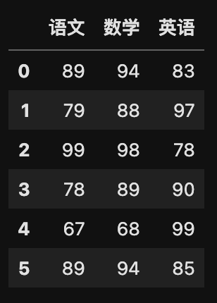

:::

### 修改DF索引

步骤：

1. 构建新的索引
2. 设置新的索引：DF对象.index = 新的索引

:::details 示例：

```python
import pandas as pd

# 构建数据
data_x = [[89, 94, 83], [79, 88, 97], [99, 98, 78], [78, 89, 90], [67, 68, 99], [89, 94, 85]]
data_index = ["学生1", "学生2", "学生3", "学生4", "学生5", "学生6"]
data_col = ["语文", "数学", "英语"]

# 创建 DataFrame
my_data = pd.DataFrame(data_x, data_index, data_col)

# 构建新的索引
new_index = ["A", "B", "C", "D", "E", "F"]
# 设置新的索引
my_data.index = new_index
my_data
```

运行结果：

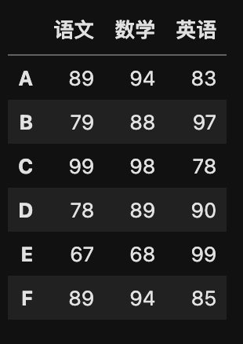

:::


