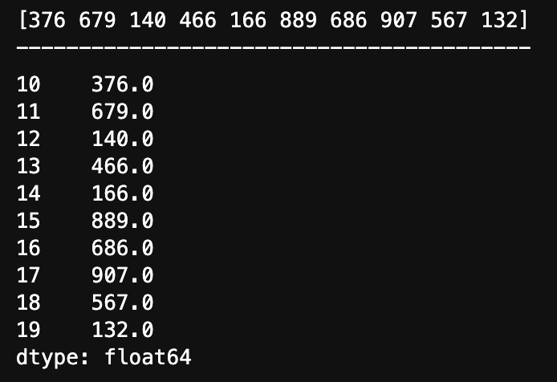

# Pandas

## <FontIcon icon="home" size="20" />简介

Pandas是一个以 Numpy 为基础开源的 Python 库。

### 为什么使用 Pandas ?

- 增强图表可读性

:::tabs

@tab Numpy 图表


@tab Pandas 图表


:::

- 数据处理能力更快捷
- 读取文件方便
- 封装了 Numpy

## 安装

使用 pip 安装即可

```python
pip install pandas
```


## 数据结构

### Series

类似一维数组的数据结构，数据和索引组成。

### 创建 Series

1. 导入 pandas 

```python
import pandas as pd
```

2. 创建 Series

```python
pd.Series(data=None, index=None, dtype=None)
```

:::info 参数说明

- data：传入的数据，可以是 ndarray / list 等。
- index：索引，必须唯一，和数据长度一致，不传则自动默认创建 0～n 的整数索引。
- dtype：数据的类型。

:::

:::details 示例：

:::tabs

@tab:active 不传index参数

```python
import pandas as pd
import numpy as np

# 生成一组数据
x = np.random.randint(100, 1000, 10)
print(x)
print("-----------------------------------------")

# 创建 Series 数据
y = pd.Series(x)
y
```

运行结果：


@tab 传index参数

```python
import pandas as pd
import numpy as np

# 生成一组数据
x = np.random.randint(100, 1000, 10)
print(x)
print("-----------------------------------------")

# 创建 Series 数据
y = pd.Series(x, [10, 11, 12, 13, 14, 15, 16, 17, 18, 19])
y
```

运行结果：


@tab 传 dtype

```python
import pandas as pd
import numpy as np

# 生成一组数据
x = np.random.randint(100, 1000, 10)
print(x)
print("-----------------------------------------")

# 创建 Series 数据
y = pd.Series(x, [10, 11, 12, 13, 14, 15, 16, 17, 18, 19], dtype=np.float64)
y
```

运行结果：



@tab 通过字典创建

```python
score = pd.Series({"语文": 96, "数学":100, "英语":88})
score
```

运行结果：


:::

### Series 属性

Series 对象有两个属性，分别是 index 和 values。

:::details 示例

:::tabs

@tab index

```python
import pandas as pd

# 利用字典创建数据
score = pd.Series({"语文": 96, "数学":100, "英语":88})

# 输出 score 数据查看
print(score)
print("------------------------------------")

# 输出 index 数据
print(score.index)
```

运行结果：


@tab values

```python
import pandas as pd

# 利用字典创建数据
score = pd.Series({"语文": 96, "数学":100, "英语":88})

# 输出 score 数据查看
print(score)
print("------------------------------------")

# 输出 values 数据
print(score.values)
```


@tab 通过 index 获取数据

```python
import pandas as pd

# 利用字典创建数据
score = pd.Series({"语文": 96, "数学":100, "英语":88})

# 输出 score 数据查看
print(score)
print("------------------------------------")

# 直接通过索引获取 value
print(score["语文"])
```


:::


### DataFrame

类似二维数组或表格的对象，有行索引和列索引

- 行索引： `index`  `0轴` `axis=0` ，表明不同的行，横向索引。
- 列索引：`columnns` `1轴` `axis=1` ，表明不同的列，纵向索引。

:::tip

由于 `DataFrame` 名字比较长，后续文章中称其为 `DF` 。

:::

### 创建 DataFrame

1. 导入 `pandas` 

```python
import pandas as pd
```

2. 创建 `DataFrame` 

```python
pd.DataFrame(data=None, index=None, columns=None)
```

:::info 参数说明

- data：数据
- index：行标签，不传则默认创建 `0～n` 的整数索引。
- columns：列标签，不传则默认创建 `0～n` 的整数索引。

:::


:::details 示例：

:::tabs

@tab 不传 index 和 columns

```python
import pandas as pd

# 构建数据
data_x = [[101, 102, 103],[209, 208, 207]]

# 创建 DataFrame
pd.DataFrame(data_x)
```

运行结果：


@tab 传 index 不传 columns

```python
import pandas as pd

# 构建数据
data_x = [[89, 94, 83],[79, 88, 97]]
data_index = ["张三", "李四"]

# 创建 DataFrame
pd.DataFrame(data_x, data_index)
```

运行结果：


@tab 传 index & 传 columns

```python
import pandas as pd

# 构建数据
data_x = [[89, 94, 83],[79, 88, 97]]
data_index = ["张三", "李四"]
data_col = ["语文", "数学", "英语"]

# 创建 DataFrame
pd.DataFrame(data_x, data_index, data_col)
```

运行结果：


:::

### DataFrame 属性

`DataFrame` 对象的属性比较多，主要有以下这些

- shape： `DataFrame` 的形状
- axes：查看数据行和列
- index：行索引列表
- columns：列索引列表
- values：内容数据的值
- T：转置（`DataFrame` 是类似二维数组的数据，可以行和列转置）
- head(5)：显示前5行的内容，默认值为5，可修改参数值
- tail(5)：显示后5行的内容，默认值为5，可修改参数值
- sample(5)：显示随机 5 行内容，默认 1 行。可修改参数值

:::details 示例：

:::tabs

@tab shape

```python
import pandas as pd

# 构建数据
data_x = [[89, 94, 83], [79, 88, 97], [99, 98, 78], [78, 89, 90], [67, 68, 99], [89, 94, 85]]
data_index = ["学生1", "学生2", "学生3", "学生4", "学生5", "学生6"]
data_col = ["语文", "数学", "英语"]

# 创建 DataFrame
my_data = pd.DataFrame(data_x, data_index, data_col)

# 查看 shape
my_data.shape
```

运行结果：


@tab axes

```python
import pandas as pd

# 构建数据
data_x = [[89, 94, 83], [79, 88, 97], [99, 98, 78], [78, 89, 90], [67, 68, 99], [89, 94, 85]]
data_index = ["学生1", "学生2", "学生3", "学生4", "学生5", "学生6"]
data_col = ["语文", "数学", "英语"]

# 创建 DataFrame
my_data = pd.DataFrame(data_x, data_index, data_col)

# 查看 shape
my_data.axes
```

运行结果：


@tab index

```python
import pandas as pd

# 构建数据
data_x = [[89, 94, 83], [79, 88, 97], [99, 98, 78], [78, 89, 90], [67, 68, 99], [89, 94, 85]]
data_index = ["学生1", "学生2", "学生3", "学生4", "学生5", "学生6"]
data_col = ["语文", "数学", "英语"]

# 创建 DataFrame
my_data = pd.DataFrame(data_x, data_index, data_col)

# 查看 index
my_data.index
```

运行结果：


@tab columns

```python
import pandas as pd

# 构建数据
data_x = [[89, 94, 83], [79, 88, 97], [99, 98, 78], [78, 89, 90], [67, 68, 99], [89, 94, 85]]
data_index = ["学生1", "学生2", "学生3", "学生4", "学生5", "学生6"]
data_col = ["语文", "数学", "英语"]

# 创建 DataFrame
my_data = pd.DataFrame(data_x, data_index, data_col)

# 查看 columns
my_data.columns
```

运行结果：


@tab values

```python
import pandas as pd

# 构建数据
data_x = [[89, 94, 83], [79, 88, 97], [99, 98, 78], [78, 89, 90], [67, 68, 99], [89, 94, 85]]
data_index = ["学生1", "学生2", "学生3", "学生4", "学生5", "学生6"]
data_col = ["语文", "数学", "英语"]

# 创建 DataFrame
my_data = pd.DataFrame(data_x, data_index, data_col)

# 查看 values
my_data.values
```

运行结果：


@tab T

```python
import pandas as pd

# 构建数据
data_x = [[89, 94, 83], [79, 88, 97], [99, 98, 78], [78, 89, 90], [67, 68, 99], [89, 94, 85]]
data_index = ["学生1", "学生2", "学生3", "学生4", "学生5", "学生6"]
data_col = ["语文", "数学", "英语"]

# 创建 DataFrame
my_data = pd.DataFrame(data_x, data_index, data_col)

# 查看 T 转置
my_data.T
```

运行结果：


@tab head

```python
import pandas as pd

# 构建数据
data_x = [[89, 94, 83], [79, 88, 97], [99, 98, 78], [78, 89, 90], [67, 68, 99], [89, 94, 85]]
data_index = ["学生1", "学生2", "学生3", "学生4", "学生5", "学生6"]
data_col = ["语文", "数学", "英语"]

# 创建 DataFrame
my_data = pd.DataFrame(data_x, data_index, data_col)

# 查看 head
my_data.head() # 不写默认参数是 5
```

运行结果：


@tab tail

```python
import pandas as pd

# 构建数据
data_x = [[89, 94, 83], [79, 88, 97], [99, 98, 78], [78, 89, 90], [67, 68, 99], [89, 94, 85]]
data_index = ["学生1", "学生2", "学生3", "学生4", "学生5", "学生6"]
data_col = ["语文", "数学", "英语"]

# 创建 DataFrame
my_data = pd.DataFrame(data_x, data_index, data_col)

# 查看 tail
my_data.tail() # 不写则默认参数为 5
```

运行结果：


@tab sample

```python
import pandas as pd

# 构建数据
data_x = [[89, 94, 83], [79, 88, 97], [99, 98, 78], [78, 89, 90], [67, 68, 99], [89, 94, 85]]
data_index = ["学生1", "学生2", "学生3", "学生4", "学生5", "学生6"]
data_col = ["语文", "数学", "英语"]

# 创建 DataFrame
my_data = pd.DataFrame(data_x, data_index, data_col)

# 查看 sample
my_data.sample()
```

运行结果：


:::

### 设置某列为索引

#### set_index(keys, drop=True)

- keys：列标签或数组列表，需要设置为索引的列
- drop：默认为 `True` ，删除原来的列

:::details 示例：

:::tabs

@tab 设置某列为索引

```python
import pandas as pd

# 构建数据
data_x = [[89, 94, 83], [79, 88, 97], [99, 98, 78], [78, 89, 90], [67, 68, 99], [89, 94, 85]]
data_index = ["学生1", "学生2", "学生3", "学生4", "学生5", "学生6"]
data_col = ["语文", "数学", "英语"]

# 创建 DataFrame
my_data = pd.DataFrame(data_x, data_index, data_col)

# 设置 某列 为新的索引
my_data.set_index('语文', drop=True)
```

运行结果：


@tab 原数据(作对比)

```python
import pandas as pd

# 构建数据
data_x = [[89, 94, 83], [79, 88, 97], [99, 98, 78], [78, 89, 90], [67, 68, 99], [89, 94, 85]]
data_index = ["学生1", "学生2", "学生3", "学生4", "学生5", "学生6"]
data_col = ["语文", "数学", "英语"]

# 创建 DataFrame
my_data = pd.DataFrame(data_x, data_index, data_col)
my_data
```

运行结果：


:::

:::tip

它还有其他参数，比如 `inplace` ，输入布尔值，表示当前操作是否对原数据生效，默认是 `False` 。

`inplace=False` 。

其他的一些参数基本不常用，如果需要查询则可以翻看源代码函数查看。

:::

设置索引的意义参考： [ >> 建立索引 ](#建立索引)

### 重设DF索引

#### reset_index(drop = False)

- 作用：设置新的索引
- drop：默认为 `False` ,表示不删除原索引，设为 `True` 后，则删除原索引

:::tip

它还有其他的参数，但基本不常用，最经常使用的是 `drop` 。

:::

:::details 示例：

:::tabs

@tab drop=False

```python
import pandas as pd

# 构建数据
data_x = [[89, 94, 83], [79, 88, 97], [99, 98, 78], [78, 89, 90], [67, 68, 99], [89, 94, 85]]
data_index = ["学生1", "学生2", "学生3", "学生4", "学生5", "学生6"]
data_col = ["语文", "数学", "英语"]

# 创建 DataFrame
my_data = pd.DataFrame(data_x, data_index, data_col)

# 重设 DF 索引
my_data.reset_index(drop=False)
```

运行结果：


@tab drop=True

```python
import pandas as pd

# 构建数据
data_x = [[89, 94, 83], [79, 88, 97], [99, 98, 78], [78, 89, 90], [67, 68, 99], [89, 94, 85]]
data_index = ["学生1", "学生2", "学生3", "学生4", "学生5", "学生6"]
data_col = ["语文", "数学", "英语"]

# 创建 DataFrame
my_data = pd.DataFrame(data_x, data_index, data_col)

# 重设 DF 索引
my_data.reset_index(drop=True)
```

运行结果：


:::

### 修改DF索引

步骤：

1. 构建新的索引
2. 设置新的索引：DF对象.index = 新的索引

:::details 示例：

```python
import pandas as pd

# 构建数据
data_x = [[89, 94, 83], [79, 88, 97], [99, 98, 78], [78, 89, 90], [67, 68, 99], [89, 94, 85]]
data_index = ["学生1", "学生2", "学生3", "学生4", "学生5", "学生6"]
data_col = ["语文", "数学", "英语"]

# 创建 DataFrame
my_data = pd.DataFrame(data_x, data_index, data_col)

# 构建新的索引
new_index = ["A", "B", "C", "D", "E", "F"]
# 设置新的索引
my_data.index = new_index
my_data
```

运行结果：


:::

## 快速入门

通常数据处理和分析大体上可以分为四个步骤：

1. 准备数据
2. 读取数据
3. 查看、验证数据
4. 处理数据

### 准备数据

这里准备了一份来自 [MovieLens](https://grouplens.org/datasets/movielens/) 的电影数据集，它有不同的版本，这里使用的是 `recommended for education and development` 下的版本。其 `small` 版本只有 `1M` ，方便学习。

[ml-latest-small.zip (size:1M) >>点击下载](https://files.grouplens.org/datasets/movielens/ml-latest-small.zip)

[数据使用说明](https://files.grouplens.org/datasets/movielens/ml-latest-small-README.html)

[ml-latest.zip (size:335M) >>点击下载](https://files.grouplens.org/datasets/movielens/ml-latest.zip)

[数据使用说明](https://files.grouplens.org/datasets/movielens/ml-latest-README.html)

:::tip

如数据需要有其他用途请详细查看数据使用说明。

:::

下载完成之后（这里我使用的是 `ml-latest-small` 版本），解压之后它是一个文件夹，这里需要注意名字中包含了 `-` ，为了防止因为名称中的 `-` 出现读取问题，把名字中的 `-` 删除掉。


文件夹里面包含了5个文件：


以 `.csv` 结尾的是数据， `README.txt` 是 [数据使用说明](https://files.grouplens.org/datasets/movielens/ml-latest-small-README.html) 和网站上的一样。

:::info csv 文件说明

`CVS` 文件是一种文件类型，可以在 Excel 中创建和编辑。可以理解为 `表格`  文件。

拓展：

`Comma-Separated Values` , 逗号分隔值，有时也叫字符分隔值，因为分隔符可以不是逗号。

它以纯文本形式存储表格数据。

:::

:::tip

如果你有自己的数据，也可以使用自己的数据。

:::

### 读取数据

读取数据属于文件操作，关于文件操作，后面会更进一步详细说明。常用的方法有两个。

1. pd.read_csv(文件)
    - 读取 `csv` 文件

2. pd.read_excel(文件)
    - 读取 `excel` 文件

在开始之前，请注意要把  `mlsmall`  文件夹放在和 `Python` 文件 (`pandas.ipynb`) 同一个文件夹中：


:::info 示例：读取上一小节准备的 `mlsmall` 中的 `movies.csv` 文件

```python
# 导入 pandas 库
import pandas as pd

# 读取数据
data = pd.read_csv('./mlsmall/movies.csv')

# 查看数据
data
```

运行结果：


:::

:::tip 路径

上述代码中的第 `5` 行 `'./mlsmall/movies.csv'` ，这是文件的路径。

第一个 `.` 代表当前文件夹。

这个路径的意思即：在当前文件夹下找 `mlsmall` 文件夹下的 `movies.csv` 文件。

`/` 代表了层级关系。

:::

可以尝试导入其他几个 `csv` 文件 查看其内容。

### 查看、验证数据

查看数据：

- 直接输出
- data.head(5) 查看前5条
- data.tail(5) 查看后5条
- data.sample(5) 查看随机5条

验证数据：

- data.info() 查看索引、数据类型和内存等信息
- data.describe() 查看数值型列汇总数据信息（总数、平均数、标准差、四分位数、最大值等）
- data.dtypes 查看各字段的类型
- data.axes 查看数据行和列名
- data.index 查看数据行名
- data.columns 查看数据列名

[参考    >>DataFrame 属性](#dataframe-属性)

### 建立索引

在 [设置某列位索引](#设置某列为索引) 小节中，具体介绍了函数 `set_index()` 的使用，但肯定有同学不理解为什么要设置索引，我们以当前使用的这个 `movies.csv` 为例，它的数据如下 `原数据` 展示，此时索引是 `0～9741` ，是 DataFrame 自动生成的，这个数据真正业务意义上的索引是 `'movieId'` ，在这种情况下就可以使用 `set_index()` 来修改它的索引。

:::tabs

@tab 原数据

```python
# 导入 pandas 库
import pandas as pd

# 读取数据
data = pd.read_csv('./mlsmall/movies.csv')

# 查看数据
data
```

运行结果：


@tab 查看当前的索引

```python
# 查看行索引
data.index
```


@tab 设置 'movieId' 为索引

```python
# 设置某列为索引
data.set_index('movieId')
```


:::

:::tip

需要注意的是，只设置 `set_index('movieId')` 是不能改变原本数据的，在 `设置 'movieId' 为索引`  之后，再次输出 `data` 查看：

```python
data
```

运行结果：


想要修改掉原数据(`data`) ， 则需要在 `set_index()` 中添加 `inplace=True` 参数。它默认是 `inplace=False`

示例：

```python
data.set_index('movieId', inplace=True)
data
```

运行结果：


:::

最重要的环节 `处理数据` 则需要涉及更多的关于数据的操作。后续的内容基本上围绕着 处理数据 展开。 

## 数据基本操作

test


