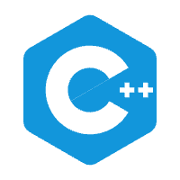

## 基本信息

    

        

        姓名：<strong><em>ChengYu</em></strong>
        

        

        性别：<strong><em>男</em></strong>
        

    

	
    <a style="text-decoration:none; display:block; width:200px; height:25px; float:left; float:left; padding-top:4px;">&nbsp;LetsCode001
    </a>

    
        <a style="text-decoration:none; display:block; float:left; padding-top:5px;">&nbsp;Letslearning.cn@gmail.com
        </a>

## 个人项目

<a style="display:block; float:left; margin-top:6px;">C++项目:</a><a style="display:block; float:left; margin-top:6px;">「从0开始的C++算法课」</a>

<a style="display:block; float:left; margin-top:7px;">bilibili主页:</a><a href="https://space.bilibili.com/25488437" style="display:block; float:left; margin-top:7px;">点击进入主页</a>

## 工作经历

> 备注：由于信息公开在互联网上，不方便透露真实姓名以及公司姓名，公司名均使用一般介绍代替
> 

#### 2023.12-2024.04
某传统教育公司&emsp;&emsp; 主管&emsp;&emsp;  
负责活动&赛事策划

#### 2023.02-2023.11
个人项目&emsp;&emsp;GESP比赛、NOI比赛(C++)

#### 2021.09-2023.02
大陆地区某大型互联网教育公司&emsp;&emsp;教研主R  
负责Python课程大纲设计、Python课程研发(游戏、爬虫、GUI、数据分析等)

#### 2019.09-2021.06
大陆地区某大型互联网教育公司&emsp;&emsp;编程项目内容负责人  
负责整体编程项目内容框架搭建和设计、团队搭建和管理。

## 学习经历
管理学学士学位&emsp;&&emsp;文学学士学位

